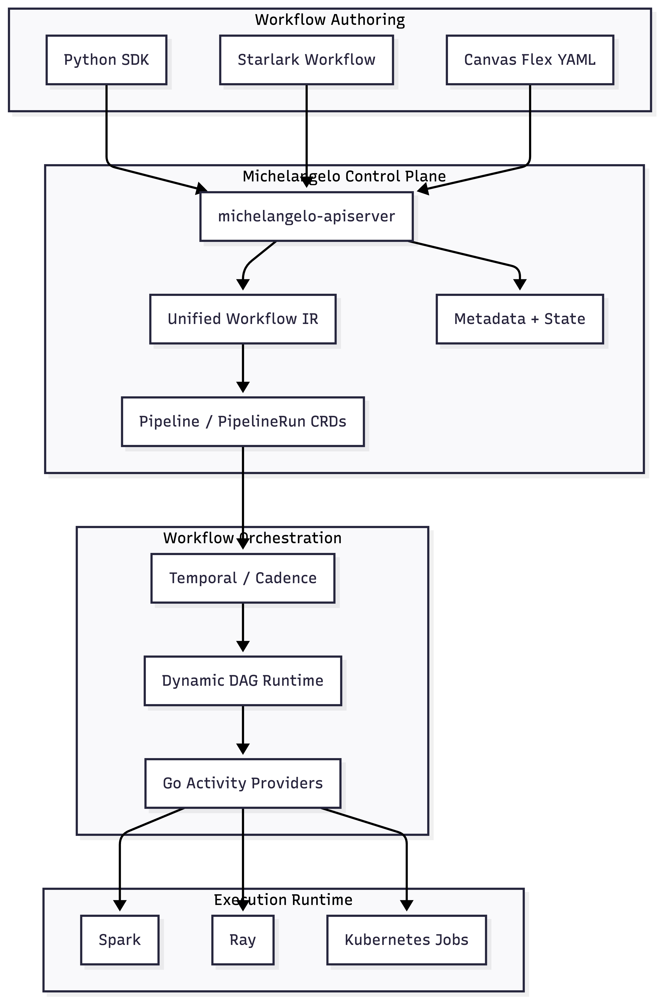

# RFC: Unifying ML and Data Processing Pipelines in Michelangelo

| Field | Value |
|---|---|
| **Authors** | badcount |
| **Date** | 2026-04-28 |
| **Status** | Draft |

---

## Summary

Michelangelo pipelines today are optimized for machine learning workflows — model training, evaluation, and deployment. Production-grade ML systems increasingly require orchestration across broader data workloads: ingestion, transformation, feature generation, batch computation, and large-scale distributed processing.

This RFC proposes evolving Michelangelo pipelines and Uniflow into a unified orchestration foundation capable of supporting both ML and data engineering workloads through a shared control plane and execution model.

---

## Value Proposition

Michelangelo pipelines were originally optimized for machine learning workloads — model training, evaluation, and deployment. Production-grade ML systems do not exist in a vacuum: they depend on large-scale data ingestion, ETL transformations, and feature engineering. Because the current platform is ML-centric, teams adopting Michelangelo are often forced to deploy and maintain a completely separate workflow engine — such as Apache Airflow or a notebook job scheduler — to handle the data processing steps that feed their ML models.

Maintaining two distinct workflow systems introduces a compounding operational burden:

- **High Operational Overhead** — Infrastructure teams must manage, scale, and patch two separate orchestration platforms, doubling on-call surfaces, logging stacks, and infrastructure costs.
- **Broken Data Lineage** — Running data engineering in one system and ML training in another breaks end-to-end data provenance. It becomes impossible to natively trace a model's lineage back to the raw data that produced it.
- **Slower Time-to-Market** — Engineers must context-switch between two different toolkits, debugging environments, and deployment paradigms just to move a single model to production.

The goal of this proposal is to eliminate the need for dual workflow platforms. By evolving Michelangelo into a unified system capable of orchestrating both heavy data processing and ML pipelines, we deliver a single infrastructure footprint that handles the entire data-to-model lifecycle.

---

## Problem Statement

The platform evolved organically around ML workflows, and orchestration responsibilities became distributed implicitly across SDKs, workflow runtimes, plugins, and backend infrastructure. This leaves no clearly defined system boundary between the three core planes: the **Definition Plane** (user authoring space), the **Control Plane** (API and state management), and the **Execution Fleet** (workers).

Without a formalized three-layer boundary model, new capabilities are implemented as isolated, workflow-specific behaviors rather than reusable platform primitives. This manifests in four concrete problems:

### 1. Monolithic Workflow Artifacts and Low-Code Rigidity

The low-code visual workflow builder was designed around rigid, pre-defined workflow templates — a practical tradeoff that promoted consistent ML quality and simplified the user experience. However, because user DAG topology and platform execution code are co-mingled into a single artifact at construction time, low-code users cannot dynamically rewire graph edges or task-dependency relationships at runtime. Any routine backend bug fix or plugin update also forces a client-side SDK version bump across all users.

### 2. Active State Store Saturation and Instant Eviction

The active state store holds heavy payloads — debug logs, execution metrics, and dataset metadata — inside a single unfragmented run record. To stay within storage capacity limits, the control plane must immediately evict failed runs. Because state is destroyed on failure, the platform cannot support native retry-from-failure or automated disaster recovery. Users must create an entirely new run from scratch.

### 3. Stateless Triggers and No Lifecycle Controls

Pipeline schedules and event triggers operate as fire-and-forget API calls with no persistent tracking entity in the control plane. Active runs are opaque, untracked sessions. There is no mechanism to gracefully pause or resume an active pipeline when an upstream dependency goes down. The only operational control available is a destructive, data-wiping cancel.

### 4. Runtime Functional Inversion

Heavy infrastructure lifecycles — cluster provisioning (Spark, Ray), credential injection, remote job submission, and polling loops — execute inside the embedded scripting engine rather than natively in the Go worker process. Large telemetry payloads must constantly cross the Go-to-script memory boundary, creating serialization overhead and wasting worker CPU cycles. Running infrastructure logic inside a scripting engine also blocks standard unit testing and IDE debugging, making the execution plane difficult to validate and maintain.

**The primary challenge is not feature enablement. It is defining a generalized, three-layer orchestration architecture with stable system boundaries capable of supporting future orchestration evolution consistently across both ML and data engineering workloads.**

---

## Goals

- Define explicit, stable system boundaries across the Definition Plane, Control Plane, and Execution Fleet
- Converge orchestration semantics (retry, recovery, cleanup, credential persistence) into a shared control plane
- Introduce a Unified Workflow Intermediate Representation (IR) as the canonical orchestration contract
- Enable high-code workflows (Python/Starlark) to participate in the same observability and visualization model as declarative (YAML) workflows
- Support dynamic DAG execution (conditional branching, fan-out/fan-in, runtime task generation) through a late-bound topology model
- Preserve existing workflow authoring paradigms; no migration required for existing workflows

## Non-Goals

- Replacing existing data processing pipelines with Uniflow
- Achieving full feature parity between Cadence and Temporal workflow runtime engines
- Requiring migration or rewrite of existing workflows
- Building a standalone orchestration platform outside Michelangelo

---

## Proposal

To permanently resolve these boundary leaks and operational gaps, this proposal replaces our organically tangled system with an **Intent-Driven 3-Layer Orchestration Architecture**. By drawing a hard line between core system responsibilities, we completely decouple user intent from platform execution.

Instead of spreading logic implicitly across the stack, this architecture maps four core software responsibilities directly into three isolated, physical deployment planes:

- **Workflow Definition** — How users configure pipelines (restricted entirely to the Definition Plane).
- **Orchestration Semantics** — How the platform handles state transitions, retries, and triggers (managed by the Control Plane).
- **Execution Implementation** — How workers execute graph choreography and track jobs (run within the Execution Fleet).
- **Infrastructure Lifecycle Management** — How the backend provisions compute resources and handles logging data (isolated to Go-native worker space).

### The New Orchestration Model

| Layer | Primary Platform Responsibility |
|---|---|
| Workflow Authoring | Users write code in Python/Starlark or arrange boxes in the Canvas YAML. This only captures the user's layout intent and contains zero execution code. |
| Orchestration Control Plane | The API Server manages the run lifecycle, coordinates safe retry windows, and acts as the central state controller. |
| Asynchronous Storage | The Metadata Ingester strips heavy logs and telemetry out of the hot store (ETCD) and pushes them to MySQL to keep the system fast. |
| Workflow Runtime | The Temporal/Cadence engine manages dynamic, late-bound DAG paths (loops, branches, and expansions) deterministically. |
| Execution Providers | Go-native worker fleets handle server-side hydration. They run the heavy infrastructure lifecycles (Spark, Ray, Kubernetes cluster setups and polling loops). |

### Design Principles

| Principle | Description |
|---|---|
| Workload-Agnostic Engine | The core system does not care if a task is an ML training script or a Data Engineering ETL pipeline. Every step is treated as a uniform, schedulable block. |
| Separation of Setup and Execution (Server-Side Hydration) | The user construction plane should only emit the workflow DAG and high-level intent, completely stripped of platform implementation details. Following standard Declarative Programming Patterns, the authoring layer focuses entirely on *what* the pipeline should achieve, while the platform handles *how* it runs. This mirrors Kubernetes API Architecture, ensuring the user space remains independent of backend infrastructure updates and hydration. |
| Platform-Managed Resiliency & Retries | Retries, caching, cleanup, and token updates are centralized platform features handled inside the control plane. Individual plugin developers and end-users do not write failure-handling code. |
| Unified Observability | Every pipeline — whether written in Python or built on the UI Canvas — is translated into the exact same layout blueprint before running. This gives high-code and low-code workflows total parity for visual graphs and tracking. |

---

## High-Level Architecture

The proposed architecture establishes three physical deployment planes with defined responsibilities:

### Layer Responsibilities

| Plane | Components | Responsibility |
|---|---|---|
| Client Construction Domain | Uniflow workflow, SDK, Starlark Manifest, YAML Translator | Normalizes all authoring paradigms (Python, Starlark, YAML) into a Lean IR Tarball containing only the user DAG — zero execution logic |
| Michelangelo Control Plane | IR Tarball Ingestion API, Reconciliation Loop (Cadence/Temporal), CRD CRUD (K8s State Management), Metadata Ingester, Uniflow task management plugins | Manages run lifecycle, K8s CRD state, retry windows (delayed with TTL before immutable move to metadata storage), and offloads analytical data to MySQL |
| Execution Plane | Workflow Engine (Cadence/Temporal Cluster), Go Worker Process (starlark-go VM), Activity Providers | Dispatches jobs to the Starlark Worker Fleet; interprets the Lean Starlark Manifest; drives pluggable infrastructure drivers (Triton/Dynamo, K8s Pods, Podman/Docker, S3/HDFS) |

### Four Architectural Principles

| Principle | Description |
|---|---|
| Workload-Agnostic Engine | The core system does not care if a task is an ML training script or a Data Engineering ETL pipeline. Every step is treated as a uniform, schedulable block. |
| Separation of Setup and Execution (Server-Side Hydration) | The user construction plane should only emit the workflow DAG and high-level intent, completely stripped of platform implementation details. Following standard Declarative Programming Patterns, the authoring layer focuses entirely on *what* the pipeline should achieve, while the platform handles *how* it runs. This mirrors Kubernetes API Architecture, ensuring the user space remains independent of backend infrastructure updates and hydration. |
| Platform-Managed Resiliency & Retries | Retries, caching, cleanup, and token updates are centralized platform features handled inside the control plane. Individual plugin developers and end-users do not write failure-handling code. |
| Unified Observability | Every pipeline — whether written in Python or built on the UI Canvas — is translated into the exact same layout blueprint before running. This gives high-code and low-code workflows total parity for visual graphs and tracking. |

---

## Alternatives Considered

### 1. Extend existing Uniflow workflows ad hoc

Continue adding ML and DE capabilities directly to Uniflow workflows as one-off features without addressing the architectural boundaries.

**Tradeoff:** Lowest short-term cost, but perpetuates the fragmentation described in the problem statement. Each new capability re-opens foundational architectural questions, and migration complexity grows over time. Rejected because the cumulative cost outweighs incremental savings.

### 2. Build a separate data engineering pipeline system

Create a parallel orchestration system for DE workloads, independent from Michelangelo pipelines.

**Tradeoff:** Clean separation of concerns in the short term, but introduces two independent control planes, two observability models, and two sets of reliability semantics. Rejected because it directly increases the fragmentation this proposal aims to reduce.

### 3. Adopt an external orchestration platform (e.g. Airflow, Prefect, Metaflow)

Replace the Michelangelo orchestration layer with an external system for generalized workflow orchestration.

**Tradeoff:** Leverages existing community investment but requires migration of all existing Uniflow and Temporal-based workflows, loses platform-specific integrations (RBAC, credential lifecycle, observability), and cedes platform control. Rejected as inconsistent with Non-Goals and with Michelangelo's role as the orchestration foundation.

---

## Open Questions

1. **IR versioning strategy** — How should the Workflow IR schema be versioned? What is the compatibility guarantee across platform versions?

2. **Dynamic DAG state persistence** — What durability guarantees does the workflow runtime provide for dynamically generated tasks? How is replay handled for fan-out operations?

3. **Provider plugin contract** — Should execution providers be in-process plugins or out-of-process services? What are the isolation and failure semantics?

4. **Observability convergence** — What is the minimal IR metadata required to enable visualization parity between high-code and declarative workflows in the short term?

5. **Credential lifecycle scope** — Which credential types (service tokens, user-delegated tokens, storage credentials) are managed by the platform versus delegated to providers?

6. **Migration path for existing workflows** — Although migration is a non-goal, what opt-in path exists for existing workflows to adopt the new IR and observability model without a full rewrite?

---

## Rollout Strategy

This proposal is intentionally architecture-first. Implementation is expected to proceed in phases:

**Phase 1 — Control plane boundary formalization**
Define the Orchestration Control Plane contract. Establish the Michelangelo API Server as the authoritative lifecycle manager. No changes to existing workflow authoring or execution.

**Phase 2 — Unified Workflow IR**
Introduce the IR schema. Begin converting YAML workflows to IR at submission time. High-code workflows continue to execute opaquely but IR conversion becomes available as an opt-in.

**Phase 3 — Observability convergence**
Route IR-derived DAG metadata to the shared observability model. Enable workflow visualization for high-code workflows that have adopted IR conversion.

**Phase 4 — Provider plugin interface**
Formalize the provider plugin contract. Migrate Spark, Ray, and Kubernetes provider implementations to the standardized interface.

**Phase 5 — Platform-managed reliability**
Centralize retry, recovery, and credential lifecycle into the control plane. Deprecate provider-specific reliability implementations.

Feature flags will gate each phase independently. Existing workflows remain unaffected until they explicitly opt into new behaviors.

