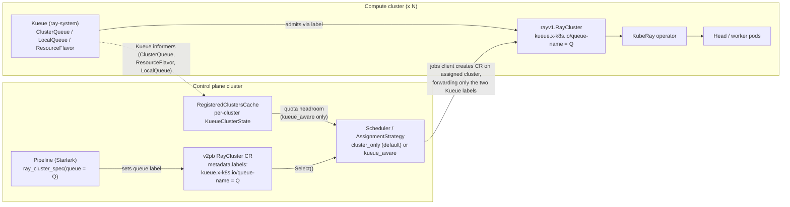
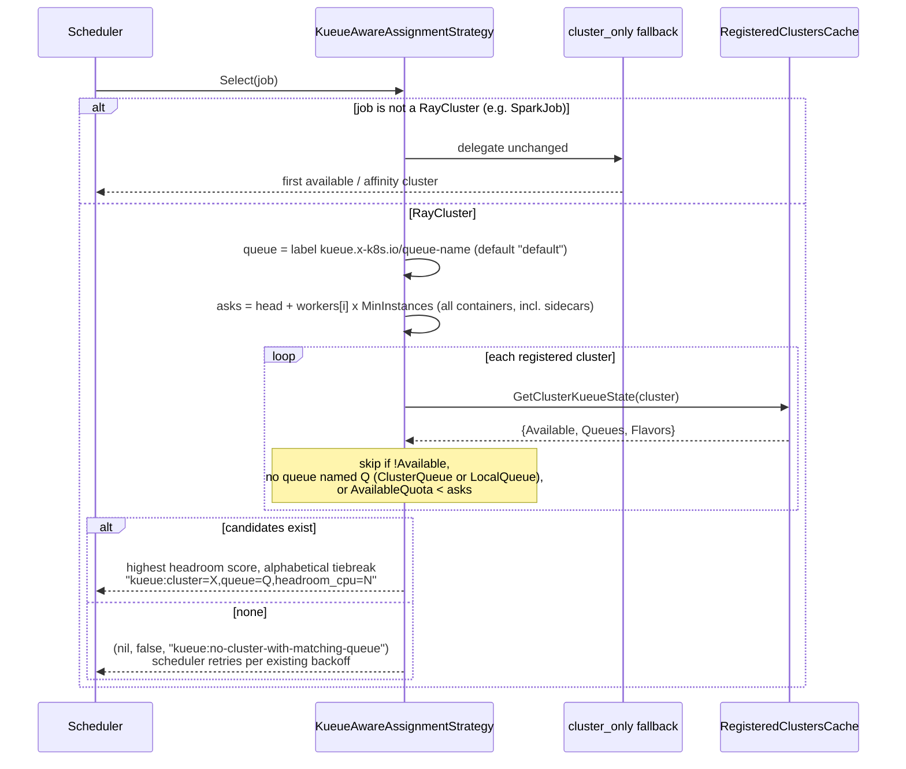

# RFC-20260731: Kueue-Based Queueing and Multi-Cluster Assignment for Ray Workloads

- **Status:** Draft
- **Author(s):** @dragod812
- **Created:** 2026-07-31

---

## Problem statement

Michelangelo submits Ray workloads to compute clusters with no queueing, priority, or quota enforcement:

1. A pipeline calls the `ray.create_cluster()` Starlark activity, which creates a Michelangelo `v2pb.RayCluster` CR in the **control plane** cluster.
2. The control plane scheduler picks a target compute cluster via `framework.AssignmentStrategy.Select()`. The only implementation (`cluster_only`) picks the first available cluster or matches an affinity label — it never looks at capacity.
3. The jobs client maps the v2pb RayCluster to a KubeRay `rayv1.RayCluster` and creates it on the target compute cluster, where the KubeRay operator immediately creates head/worker pods.

The gaps, concretely:

| # | Problem | Impact | Priority |
|---|---|---|---|
| 1 | **No job-level admission control** — the kube-scheduler sees pods, not jobs. Nothing understands "this RayCluster needs a head + N workers as a unit", and nothing gates submission on remaining capacity. | Jobs pile onto an exhausted cluster: cascading partial starts, OOM kills, excess pods parked `Pending` with no fairness or ordering. | P0 |
| 2 | **No gang scheduling** — pods of a distributed job are scheduled one at a time; a RayCluster can get its head placed while every worker is stuck `Pending`. | Deadlocks and wasted GPU-hours: an idle head holds a GPU waiting for workers that may never fit. | P0 |
| 3 | **No queue visibility** — no way to see how many jobs are waiting, why a job hasn't started, or when it plausibly will. | Users re-submit "stuck" jobs and create duplicates; no capacity-planning signal; "why is my job pending?" requires kubectl archaeology. | P1 |
| 4 | **No hardware-aware routing** — node selectors/affinity must be hand-configured per job; there is no abstraction for "run on A100s, fall back to L40S". | Misconfigured selectors, jobs landing on the wrong compute cluster, one GPU SKU idle while another is overloaded. | P1 |
| 5 | **No multi-tenant quota management** — Kubernetes `ResourceQuota` is static, namespace-scoped, and binary (hard reject); no borrowing, lending, or fair sharing between teams. | One team can monopolize the GPU pool while everyone else queues indefinitely — a blocker as more teams onboard. | P2 |
| 6 | **No job-level priority or preemption** — `PriorityClass` orders pods, but nothing can order or preempt whole jobs. | A long-running dev experiment blocks a time-sensitive production training run, with no way to say "this job matters more". | P2 |

Michelangelo's multi-cluster layer adds a seventh, platform-specific gap: **capacity-blind placement** — with several compute clusters registered, assignment ignores which cluster actually has headroom.

## Motivation

Queueing, priority, and quota are table stakes for a multi-tenant batch platform. Kubernetes [Kueue](https://kueue.sigs.k8s.io/) is the CNCF-standard job queueing layer and ships a first-class RayCluster integration — building admission control ourselves would duplicate it poorly. Adopting Kueue per compute cluster (Phase 1) gives immediate queueing/priority/quota, and surfacing each cluster's Kueue state to the control plane (Phase 2) turns multi-cluster assignment from "first available" into "most likely to admit quickly."

The pressure is concrete for large multi-team GPU deployments (AV Labs is the first adopter driving this): the P0 rows above burn real GPU-hours today — partial starts holding idle heads on GPUs with no admission gate — and every newly onboarded team sharpens the quota and priority rows from P2 toward blocker.

## Goals

- Every sandbox-provisioned cluster that runs Ray workloads (each dedicated compute cluster, or the control-plane cluster when it doubles as one) runs Kueue with a default `ResourceFlavor` / `ClusterQueue` / `LocalQueue`, so RayClusters are admitted through Kueue out of the box.
- A RayCluster is admitted **as a unit**: Kueue reserves quota for the head and all worker groups atomically and holds the CR suspended until everything fits — no more head-without-workers partial starts (placement-level caveat in Non-goals).
- Pipelines can target a queue and a priority class with **zero proto/API changes**, via a `queue` parameter on the Starlark `ray_cluster_spec()` helper (default `"default"` — existing pipelines are unaffected).
- The control plane can optionally use live per-cluster Kueue state (quota headroom per queue) to pick the target compute cluster, behind a config flag that defaults to today's behavior.
- Clusters without Kueue installed keep working unchanged under the default strategy, and are transparently skipped by the Kueue-aware strategy.

## Non-goals

- **MultiKueue** (Kueue's built-in multi-cluster dispatch) — see Alternatives.
- **True gang placement.** Kueue provides all-or-nothing *quota admission*; after admission the kube-scheduler still binds pods individually, so workers can queue behind real node capacity if quotas overstate it. Kueue's `waitForPodsReady` (requeue-on-timeout) is the hardening knob — deliberately not enabled by default here, both because it is installation-wide rather than per-queue and because eviction is destructive for a cluster that already went ready (see High-level architecture and Open questions).
- **Per-SKU hardware routing defaults.** The provisioned `default-flavor` is deliberately SKU-agnostic. `ResourceFlavor`s carrying node labels/taints per GPU SKU (A100 vs L40S, with in-queue fallback ordering) are the designed extension path via operator YAML, not shipped defaults (see Open questions).
- Kueue admission for **RayJob as a separate gated workload**. The chart's `frameworks` list narrows the upstream default to `batch/job` and `ray.io/raycluster`, switching `ray.io/rayjob` off, and labels are plumbed only through the RayCluster mapping path. That narrowing is a design conclusion rather than deferred work: Michelangelo's Ray path creates a RayCluster and then a RayJob that targets it via `spec.clusterSelector` (`k8sengine/ray.go`), and current Kueue deliberately ignores `clusterSelector` RayJobs — its webhook and reconciler skip them, on the reasoning that the pre-existing cluster is where the resources live and was already admitted ([kueue#7218](https://github.com/kubernetes-sigs/kueue/issues/7218)). Gating the RayCluster therefore already gates everything that consumes capacity; the RayJob's small submitter pod rides along outside quota. See Open questions for why un-narrowing is also risky specifically on the pinned 0.10 line.
- Kueue admission for **SparkJob** or other non-Ray batch types. They must, however, remain schedulable when the Kueue-aware strategy is enabled (see High-level architecture — this was a gap in the original internal spec).
- Kueue's borrowing / cohort / preemption features. Defaults are provisioned; operators can layer these on via Kueue YAML.
- Migrating existing pipelines to non-default queues.
- Surfacing Kueue queue positions in the Michelangelo UI (see Open questions).

## High-level architecture



The Kueue-aware assignment decision under `assignmentStrategy: kueue_aware`:



### The label contract (no proto changes)

Queue and priority ride on Kubernetes object metadata labels end to end. The original internal spec proposed adding `queue_name` / `priority_class_name` fields to the `RayClusterSpec` proto; that was rejected during implementation (see Alternatives) in favor of:

| Label | Set by | Read by | Semantics |
|---|---|---|---|
| `kueue.x-k8s.io/queue-name` | Starlark plugin on the v2pb RayCluster's `metadata.labels` | Go jobs client (forwards to KubeRay CR); Kueue-aware strategy; Kueue admission | LocalQueue the workload joins. The Go client **always** emits it on the KubeRay CR, defaulting to `"default"` — Kueue ignores unlabeled resources entirely, which would silently bypass queueing. |
| `kueue.x-k8s.io/priority-class` | User via v2pb `metadata.labels` (optional) | Go jobs client (forwards only if non-empty); Kueue | Names a Kueue `WorkloadPriorityClass` (not a Kubernetes `PriorityClass`). Affects queue ordering only, never pod scheduling. |

The Go jobs client forwards **only these two labels** onto the KubeRay RayCluster — arbitrary user-label propagation is explicitly out of scope to keep the CR surface stable. That two-label allowlist is deliberate: it is what keeps internal control-plane labels (notably `michelangelo/cluster-affinity`) off compute-cluster objects.

#### Queue selection is user-supplied — and what that does and does not buy

Both labels originate with the pipeline author: `queue` is a `ray_cluster_spec()` parameter, and the
priority label is set directly on `metadata.labels`. Nothing in the Phase 1 path validates that the
requested queue belongs to the requesting project, so a pipeline can name any LocalQueue on the target
cluster and draw against that queue's quota.

This is worth stating plainly rather than leaving implied, because it bounds what problem #5
(multi-tenant quota) is actually solved in Phase 1:

- **What quota does buy, even with user-chosen queues.** A ClusterQueue is a hard ceiling. No workload
  admits beyond its nominal quota regardless of who submits it, so the cluster-wide "one team exhausts
  everything" failure is closed by construction, and per-queue accounting becomes real.
- **What it does not buy.** *Isolation between* teams is advisory. Team A can spend Team B's guaranteed
  share by naming B's queue — accidentally (a copy-pasted pipeline) as easily as deliberately.

Phase 1 accepts this because the shipped topology is a single `default` queue per cluster, where there
is no other queue to misname, and because the alternative — a project→queue mapping — needs a
control-plane notion of project ownership that the dispatch path does not have yet (all Ray objects land
in one namespace, `RayLocalNamespace`; see Open questions).

The moment an operator provisions a second LocalQueue, the gap becomes real, so **enforcement is a
Phase 2 requirement, not an optional hardening**: the control plane resolves the queue from the job's
project and overrides any user-supplied `kueue.x-k8s.io/queue-name`, with a convention-based default
(`ma-<project>`) plus an operator override map for existing Kueue estates, and a clear dispatch-time
failure when the resolved queue does not exist. The label contract above is unchanged by this — only the
*writer* of the queue label moves from the Starlark plugin to the control plane, which is why Phase 1's
plumbing is not wasted. (This approach is argued well in
[enhancements#19](https://github.com/michelangelo-ai/enhancements/pull/19); see Alternatives.)

### Prerequisites in the current Ray path

Two properties of today's Ray path are load-bearing for everything below. The first has landed; the
second has not, and queueing is unsafe to enable without it.

**1. The control plane must not destroy suspended clusters — *done*.** A Kueue-held RayCluster sets
`spec.suspend=true`, and KubeRay then reports `HeadPodReady=False` because the pods are intentionally
absent. Until recently the k8s engine mapped that to `RAY_CLUSTER_STATE_UNKNOWN`, and the ray cluster
controller read UNKNOWN-plus-terminal-pod-errors as FAILED and terminated the cluster — observed live on
a Kueue-gated cluster that Kueue admitted ~1 second after creation.
[PR #1700](https://github.com/michelangelo-ai/michelangelo/pull/1700) fixed this with a first-class
non-terminal `RAY_CLUSTER_STATE_SUSPENDED` and merged; the enum is on `main`. This RFC assumes it and
builds the queued-state reporting on top of it.

**2. Queueing must escape the 30-minute creation budget — *not yet done, and required*.** The entire
create-and-wait path shares a single 1800-second budget:
`DEFAULT_CREATE_CLUSTER_TIMEOUT_SECONDS = 60 * 30` in `python/michelangelo/uniflow/plugins/ray/task.star`
is passed to `ray.create_cluster`, and the Go plugin assigns it to the readiness sensor's
`ExpirationInterval` (`go/worker/plugins/ray/starlark_module.go`). On expiry the plugin terminates the
cluster and fails the task.

That budget was sized for *provisioning* — pulling images and starting pods — but it currently also
covers *waiting for admission*. Left alone, a job legitimately queued behind quota for 31 minutes fails,
which directly contradicts this RFC's central promise that jobs queue instead of failing. The failure
gets more likely the deeper the queue, so it would surface exactly when queueing is doing its job. The
same 1800-second constant also derives `RAY_NUM_REDIS_GET_RETRIES`, the existing workaround for the
absence of gang scheduling.

The design therefore splits the budget by phase:

- While the cluster is `SUSPENDED`, the readiness sensor does not consume the creation budget. The
  admission wait is bounded by Kueue-native mechanisms (and, optionally, an operator-set queue timeout),
  and is reported through the suspended state rather than as a pending failure.
- The 1800-second budget starts when Kueue flips `suspend=false`, covering admission → readiness, which
  is the phase it was always sized for.

This touches the sensor activity and the Ray plugin, and is sequenced as its own PR in Phase 1 below
rather than left as an implementation detail. On Kueue-managed clusters the inflated
`RAY_NUM_REDIS_GET_RETRIES` also becomes unnecessary, since gang admission removes the condition it
compensates for; the default stays for non-Kueue clusters.

### Phase 1 — per-cluster Kueue admission

1. **Install:** Kueue ships as a subchart of the `helm/michelangelo-compute` chart (`oci://registry.k8s.io/kueue/charts`, pinned `0.10.6`), released into `ray-system` alongside the KubeRay operator subchart. The sandbox installs the chart on every cluster that runs Ray workloads: each dedicated compute cluster it provisions, or the control-plane cluster when it doubles as the compute cluster (there the KubeRay subchart is toggled off because the sandbox already installs the operator with its image imports). The chart's `kueue.managerConfig` values set `integrations.frameworks: ["batch/job", "ray.io/raycluster"]`. Kueue only manages workload kinds named in this list — a RayCluster is invisible to admission unless `ray.io/raycluster` is enabled — but note this setting *narrows* rather than extends: the upstream 0.10.6 chart enables ten frameworks by default, so we are switching eight of them off (including `ray.io/rayjob`) and keeping only the two the platform plumbs the queue label for. Each enabled framework also costs a webhook and controller on every compute cluster.
2. **Default queue resources:** the chart templates one `ResourceFlavor` (`default-flavor`, no node selectors), one `ClusterQueue` (`default-cluster-queue`: cpu=16, memory=32Gi, nvidia.com/gpu=4, `namespaceSelector: {}`), and one `LocalQueue` (`default` in namespace `default`), all driven by `kueueQueues.*` values so names and quotas are overridable per cluster.
   - **Ordering constraint (two-phase install):** Helm's `--wait` only waits for the controller-manager Deployment, *not* CRD establishment, and one release cannot install a CRD and its instances in the same pass. The queue objects are therefore gated behind `kueueQueues.enabled` (default off): the sandbox first upgrades the chart with queues off, explicitly `kubectl wait --for=condition=Established` on the three queue CRDs, then re-runs the upgrade with `kueueQueues.enabled=true`. Skipping the wait races the apply (`NoMatchError`).
   - **Namespace invariant:** Kueue admits a workload only if the referenced LocalQueue exists in the *workload's* namespace. The jobs client creates KubeRay RayClusters in the fixed local namespace (`default`), and the provisioned LocalQueue lives in `default` — these must stay in lock-step. Operators adding queues must create a LocalQueue in every namespace workloads run in.
3. **Producer/consumer plumbing:** `ray_cluster_spec(..., queue = "default")` sets the queue-name label on the v2pb CR; the Go jobs client maps it (with defaulting) onto the KubeRay CR as described above.

Unadmitted RayClusters are held suspended by Kueue and become visible via `kubectl get workload -A` / `kubectl describe clusterqueue` on the compute cluster, and as `RAY_CLUSTER_STATE_SUSPENDED` through the Michelangelo API.

**Eviction is not uniformly recoverable, and the difference matters.** Kueue can evict an admitted
workload (preemption, or a `waitForPodsReady` timeout if an operator enables it), and the consequences
depend entirely on whether the cluster had already become ready:

- **Evicted before ready** — preempted while still pending, or pods never all came up. Kueue
  re-suspends the object and requeues it. The cluster returns to `SUSPENDED`, the readiness sensor keeps
  waiting (per the budget split above), and nothing fails. This is the well-behaved path.
- **Evicted after ready, with a Ray job running on it** — the workers are deleted and the running task
  fails. Recovery is Uniflow's existing task-level retry: a fresh submission that queues like any new
  job, from the start, losing in-progress work. There is no transparent mid-run requeue, and providing
  one would require checkpoint-aware resubmission that is out of scope here.

The practical consequence is that preemption policies and `waitForPodsReady` timeouts are not free to
enable on clusters running long training jobs — a point the operator guide must make alongside the
`waitForPodsReady` blast-radius caveat in Open questions.

### Phase 2 — Kueue-aware multi-cluster assignment

1. **Per-cluster Kueue clientset:** the compute client factory constructs a `sigs.k8s.io/kueue` typed clientset per registered cluster alongside the existing Ray/CoreV1 clients. Construction does no API discovery, so it never fails for Kueue-less clusters.
2. **Informer-backed cache:** for every registered cluster, the cluster controller runs Kueue informers (ClusterQueue, ResourceFlavor cluster-scoped; LocalQueue all-namespaces) with a 5-minute resync, maintaining a per-cluster snapshot in `RegisteredClustersCache`:
   - `ClusterQueueSnapshot{Name, NominalQuota, UsedQuota, AvailableQuota, Flavors, LocalQueueName}` with `AvailableQuota = max(0, Nominal − Used)` per resource, summed across flavors/resource groups.
   - `KueueClusterState{Available, Queues, Flavors}` — `Available=false` when Kueue is absent. Absence is detected by classifying list errors (`NotFound` or `NoKindMatchError`), logged once per cluster, and never blocks cluster registration.
   - Lifecycle: informers start when a cluster registers and are cancelled (per-cluster `context.CancelFunc`) when it is removed or the manager shuts down.
3. **`KueueAwareAssignmentStrategy`** (selected by config, below):
   - **Non-Ray fallback (required):** `AssignmentStrategy` is shared by all batch job types. The strategy embeds a `cluster_only` fallback and delegates any non-RayCluster job to it. Without this, enabling `kueue_aware` would make SparkJobs permanently unschedulable — a defect in the original spec, caught in implementation review.
   - Resolve the requested queue from the job's `kueue.x-k8s.io/queue-name` label (default `"default"`).
   - Sum resource asks: head + each worker group × `MinInstances`, in milli-units, summing **every container** in each pod template rather than `containers[0]` alone. Ray pods are not single-container when log persistence is enabled: `injectCollectorSidecar` adds a collector to the head *and* every worker template (`k8sengine/ray.go`). Counting only the first container understates each pod's real request, which inflates apparent headroom and lets the strategy route a job to a cluster that then cannot admit it — the precise failure this strategy exists to prevent, and one whose magnitude scales with worker count.
   - Candidate filter per cluster: `state.Available`, a queue whose ClusterQueue **or** backing LocalQueue name matches, and `AvailableQuota` covering every asked resource (a resource the queue doesn't declare counts as zero).
   - Score: Σ over {cpu, memory, nvidia.com/gpu} of `(available − ask) / nominal`; resources with zero nominal quota are skipped (prevents division by zero and score domination). Highest score wins; ties break alphabetically by cluster name for determinism.
   - Reason strings are prefixed `kueue:` (`kueue:cluster=X,queue=Q,headroom_cpu=N` on success, `kueue:no-cluster-with-matching-queue` on miss) so assignment decisions are grep-able in scheduler logs. On miss the scheduler retries per its existing backoff.
4. **Multi-cluster sandbox:** `--compute-cluster-name` becomes repeatable (and `--num-compute-clusters N` auto-names), with `--compute-cluster-quotas` accepting per-cluster JSON overrides passed as `kueueQueues.quota` chart values on the phase-2 upgrade (Helm's deep merge keeps unspecified resources at chart defaults) — so a two-cluster sandbox gives the strategy a meaningful choice to verify end to end.

### How the design maps to the problems

| # | Problem | Mechanism | Status |
|---|---|---|---|
| 1 | Job-level admission control | Kueue Workload admission: the RayCluster CR is held suspended until the *whole job's* quota fits; KubeRay creates no pods before that (Phase 1). | Solved |
| 2 | Gang scheduling | Admission reserves quota for the head and every worker podset atomically — no head-without-workers starts due to quota. | Solved at quota level; placement caveat in Non-goals (`waitForPodsReady` is the follow-up knob) |
| 3 | Queue visibility | A queued cluster reports the non-terminal `RAY_CLUSTER_STATE_SUSPENDED` (PR #1700) rather than `UNKNOWN`; `kubectl get workload -A` / `kubectl describe clusterqueue` give queue depth and admission errors, documented in the operator guides; scheduler reason strings (`kueue:*`) explain assignment decisions. | Partial — "queued" is now distinguishable from "broken"; reflecting Kueue's *reason* and a UI affordance is an Open question |
| 4 | Hardware-aware routing | `ResourceFlavor` is exactly this abstraction (per-SKU flavors + fallback order via operator YAML); Phase 2's headroom scoring additionally routes jobs *across clusters* by live capacity. | Mechanism landed; per-SKU defaults deferred (Non-goals / Open questions) |
| 5 | Multi-tenant quota | Per-`ClusterQueue` nominal quotas with live usage tracking replace static, binary `ResourceQuota` semantics. | Foundation — borrowing/cohorts/fair-share operator-layerable (Non-goals) |
| 6 | Job-level priority / preemption | `kueue.x-k8s.io/priority-class` → `WorkloadPriorityClass` plumbed end to end for queue *ordering*; preemption policies attach to the same contract later. | Ordering now; preemption later |
| 7 | Capacity-blind multi-cluster placement | `kueue_aware` assignment strategy scores clusters by quota headroom (Phase 2). | Solved (opt-in) |

## APIs and CRDs

No Michelangelo proto or CRD schema changes. The public surface delta:

**Starlark (uniflow Ray plugin):**

```python
ray_cluster_spec(namespace, image, head_resource, worker_resource,
                 worker_instances, debug_enabled = False,
                 runtime_env = None, queue = "default")
```

**Well-known labels on `v2pb.RayCluster.metadata.labels`** (contract above): `kueue.x-k8s.io/queue-name`, `kueue.x-k8s.io/priority-class`.

**controllermgr config** (absent key preserves legacy behavior; unknown values fall back):

```yaml
scheduler:
  assignmentStrategy: cluster_only   # or "kueue_aware"
```

**Provisioned Kueue resources** (operator contract, per cluster — rendered by the `michelangelo-compute` chart from `kueueQueues.*` values; defaults shown):

```yaml
apiVersion: kueue.x-k8s.io/v1beta1
kind: ResourceFlavor
metadata: {name: default-flavor}
---
apiVersion: kueue.x-k8s.io/v1beta1
kind: ClusterQueue
metadata: {name: default-cluster-queue}
spec:
  namespaceSelector: {}
  resourceGroups:
  - coveredResources: ["cpu", "memory", "nvidia.com/gpu"]
    flavors:
    - name: default-flavor
      resources:
      - {name: cpu, nominalQuota: 16}
      - {name: memory, nominalQuota: 32Gi}
      - {name: "nvidia.com/gpu", nominalQuota: 4}
---
apiVersion: kueue.x-k8s.io/v1beta1
kind: LocalQueue
metadata: {name: default, namespace: default}
spec: {clusterQueue: default-cluster-queue}
```

### Version pinning

Kueue is pinned to the **0.10 line** on both sides because it is built against the `k8s.io/*` v0.31 client libraries this repo uses and transitively requires `kuberay/ray-operator v1.2.2`, which the repo already pins. The Go module pin is `sigs.k8s.io/kueue v0.10.1`; the server-side subchart is pinned to `0.10.6` in `helm/michelangelo-compute/Chart.yaml` — the latest 0.10.x patch, and the closest publishable match since the `0.10.1`/`0.10.2` charts were never pushed to `registry.k8s.io`. Client and server must stay on the same minor and be bumped together.

## Alternatives considered

### Alternative A: `queue_name` / `priority_class_name` fields on the `RayClusterSpec` proto
This was the original internal spec's design.
**Pros:** typed, discoverable API; validation at CR-creation time.
**Cons:** proto change fans out into Go and Python codegen with strict cross-language PR ordering; duplicates data that must ultimately become a Kubernetes label anyway (Kueue only reads labels); spec fields imply platform semantics where none exist beyond label forwarding.
**Why not chosen:** the label contract reaches every consumer (Go client, scheduler strategy, Kueue) with zero schema migration, and `metadata.labels` already flows through the v2pb → KubeRay mapping path. Typed fields can be layered on later without breaking the label contract.

### Alternative B: MultiKueue (Kueue-native multi-cluster dispatch)
**Pros:** upstream-supported multi-cluster admission; single control-plane queue view.
**Cons:** requires a management-cluster Kueue deployment plus per-cluster kubeconfig plumbing inside Kueue's own controllers, running *beside* Michelangelo's existing scheduler — two placement brains; MultiKueue was beta-maturity at design time; harder incremental rollout.
**Why not chosen:** Michelangelo already owns cluster assignment via `AssignmentStrategy`. Feeding Kueue state into the existing strategy interface is a far smaller, reversible step. MultiKueue remains a possible future direction.

### Alternative C: single Kueue in the control plane admitting v2pb CRs
**Pros:** one Kueue install; queueing before assignment.
**Cons:** Kueue has no integration for Michelangelo's CRDs (would require building and maintaining a custom Kueue framework plugin); quota is inherently a per-compute-cluster property, which a control-plane queue cannot see without exactly the state-sync this RFC builds anyway.
**Why not chosen:** highest custom-code burden for the least upstream leverage.

### Alternative D: a `KueueJobQueue` backend behind the `JobQueue` interface
Proposed independently in [enhancements#19](https://github.com/michelangelo-ai/enhancements/pull/19), which reaches a
similar end state through a different seam: a `KueueJobQueue` implementing the existing `JobQueue`
interface, selected by an fx factory and an additive `scheduler_type` field on `ClusterSpec`.
**Pros:** uses the extension point the operator guide already advertises ("Custom Backend (e.g., Kueue,
Volcano)"); the per-cluster declaration lives in the API where the UI and `ma cluster get` can see it,
rather than in controllermgr config; makes mixed fleets explicit at the cluster object.
**Cons:** the interface does not model what happens. Kueue's queue lives *on the compute cluster*, held
as `spec.suspend`, and it cannot be relocated into a control-plane `JobQueue` because that is where the
quota is. Tracing that design's own lifecycle, the job runs `AssignmentStrategy.Select`, gets a resolved
queue label, and is dispatched suspended — leaving the `JobQueue` immediately. What the backend actually
does is choose a cluster, resolve a queue name, and stamp a label: placement and mapping, not queueing.
That work is what `AssignmentStrategy` already models, and routing it through a second `JobQueue`
implementation also costs a proto field to carry state that config already carries.
**Why not chosen:** extending `AssignmentStrategy` reaches the same behavior at the interface that
matches the decision, with no schema change. The distinction is mostly structural — both designs put
Kueue on the compute cluster and both are opt-in — so this is a disagreement about seams, not outcomes.
Two things that proposal argues are adopted here regardless: control-plane-resolved queue names (see the
label contract) and the creation-budget prerequisite (see Prerequisites). Its per-cluster `scheduler_type`
field remains a reasonable future addition if the fleet-visibility argument wins; nothing in the label
contract forecloses it.

## Open questions

- [ ] **Queued-state *reason* and UX.** The state itself is settled: [PR #1700](https://github.com/michelangelo-ai/michelangelo/pull/1700) merged a non-terminal `RAY_CLUSTER_STATE_SUSPENDED` (`proto/api/v2/ray_cluster.proto`), so a Kueue-held cluster is monitored rather than destroyed (see Prerequisites). What remains is narrower: SUSPENDED says "not running", not "waiting behind 40 GPUs of quota". Kueue creates a `Workload` CR per RayCluster whose status carries admission state and errors (`QuotaReserved` pending, `Inadmissible` with message) — watching those Workload CRs alongside the existing informers is the natural mechanism for reflecting a reason into the RayCluster status and from there into the UI. Should that reason land as a condition on the RayCluster, a dedicated status field, or stay a `kubectl`-level detail in Phase 1?
- [ ] **WorkloadPriorityClass provisioning.** The platform forwards the priority-class label but does not provision any `WorkloadPriorityClass` objects; a label naming a missing class fails admission on that cluster. Ship a small default set (e.g. `high`/`low`), or leave entirely to operators?
- [ ] **Headroom estimate vs autoscaling.** Resource asks use `MinInstances` per worker group, so headroom is optimistic for clusters that autoscale toward `MaxInstances`. Is min-based admission the right long-term contract, or should the strategy (and quota checks) consider max?
- [ ] **Kueue upgrade cadence.** v0.10.x tracks k8s 0.31; when the repo bumps `k8s.io/*`, which Kueue line do we move to? The server-side pin now lives in one overridable place — the `kueue` dependency in `helm/michelangelo-compute/Chart.yaml` — so a bump is that chart pin plus the matching `sigs.k8s.io/kueue` Go-module bump.
- [ ] **`waitForPodsReady`.** Enabling Kueue's all-or-nothing startup (evict and requeue when pods don't all become ready within a timeout) closes two gaps at once: the quota-admission-vs-true-gang-placement gap, and **crashlooping jobs holding GPUs** — on timeout (covering both `ImagePullBackOff`, never Ready, and `CrashLoopBackOff`, loses Ready) Kueue suspends the job, deletes its pods, returns quota to the ClusterQueue, and requeues with exponential backoff. What timeout/backoff defaults are safe for ML workloads with long image pulls? Note the blast radius when deciding: `waitForPodsReady` is Kueue **installation-wide** `Configuration`, not a per-ClusterQueue setting (a per-queue override is only an open upstream request, [kueue#7542](https://github.com/kubernetes-sigs/kueue/issues/7542)), so enabling it governs *every* Kueue-managed workload on that compute cluster, not only Michelangelo's. On a shared cluster that is an operator-level decision, and the operator guide must say so.
- [ ] **RayJob integration — and whether it is reachable at all on the pinned line.** AV Labs runs RayJobs as well as RayClusters, and `ray.io/rayjob` is an upstream chart default this RFC deliberately switches off — so enabling it is un-narrowing the `frameworks` list plus forwarding the two Kueue labels through the RayJob mapping path. Until both land a RayJob carries no queue label and Kueue would ignore it anyway, so the two halves must ship together. There is a prior question, though: even with both, Michelangelo's RayJobs set `spec.clusterSelector`, and current Kueue skips such RayJobs outright ([kueue#7218](https://github.com/kubernetes-sigs/kueue/issues/7218)) — so on a recent Kueue the fast-follow buys nothing, because gating the RayCluster already gated the capacity. Worse on the pinned line: that skip postdates 0.10, so on 0.10.6 un-narrowing may instead gate our RayJobs as *independent* workloads, double-counting quota their RayCluster already reserved or stranding them behind quota that never frees. Phase 1's test plan should assert the actual 0.10.6 behavior before anyone flips this. Is RayJob gating worth wanting once the RayCluster is gated, and if so does it justify moving the pin (see Kueue upgrade cadence)?
- [ ] **Quota sizing inputs.** Two facts operators need when setting `nominalQuota`, both currently undocumented: the log-collector sidecar (100m CPU / 128Mi, when log persistence is enabled) is counted *inside* the gated pod sets, on the head and every worker; the RayJob submitter pod runs *outside* Kueue quota entirely. Should the operator guide carry a worked sizing example, or is stating both facts sufficient?
- [ ] **Per-SKU ResourceFlavor taxonomy.** Should the platform ship flavors for common GPU SKUs (e.g. A100, L40S, H100) with fallback ordering inside the default ClusterQueue, or leave flavor design entirely to operators? Shipping defaults makes "run on A100s, fall back to L40S" declarative but couples the platform to a hardware catalog.

## Rollout strategy

- **Phase 0 (prerequisites, must precede enabling queueing anywhere):** the merged non-terminal `RAY_CLUSTER_STATE_SUSPENDED` (PR #1700, done) plus the creation-budget split in the Ray plugin and readiness sensor, so suspended time no longer consumes the 1800-second provisioning budget. The budget split is the one piece not yet built, and it gates everything: without it, admission delays past 30 minutes fail the very jobs this RFC promises to queue.
- **Phase 1 (shippable alone, after Phase 0):** the `michelangelo-compute` Helm chart (KubeRay operator + Kueue subcharts, `ray-manager` RBAC, default queues) installed on every sandbox cluster that runs Ray workloads; label plumbing Starlark → v2pb → KubeRay; docs (`configure-kueue-queues.md`, uniflow guide updates). Backward compatible: the forced `"default"` queue label plus provisioned default queues mean existing pipelines admit exactly as before, now visibly through Kueue.
- **Phase 2:** per-cluster Kueue clientset + informer cache; `KueueAwareAssignmentStrategy`; multi-cluster sandbox; `multi-cluster-kueue-assignment.md` docs. Also the point at which queue selection moves from the pipeline author to the control plane (project → LocalQueue resolution), which is a **requirement** once a cluster carries more than one LocalQueue — see the label contract.
- **Feature flag:** `scheduler.assignmentStrategy` defaults to `cluster_only`; `kueue_aware` is strictly opt-in. Rollback = unset the flag (assignment reverts instantly; Phase 1 admission continues unaffected).
- **Kueue-less clusters:** never fail registration; they are skipped by `kueue_aware` and fully served by `cluster_only`.
- **Production clusters:** the sandbox flow is the reference implementation; production compute clusters (e.g. AV Labs on OKE) install the same `michelangelo-compute` chart through their own provisioning pipelines, overriding `kueueQueues.*` values (quotas sized to real capacity, plus queue names/namespaces as needed).
- **Implementation mapping:** landed as a six-PR stack — (0) `helm/michelangelo-compute` chart (KubeRay operator subchart + `ray-manager` RBAC) replacing the sandbox's raw manifests, (1) Kueue subchart + chart-templated default queues via the two-phase install, (2) label plumbing end-to-end + Phase 1 docs, (3) per-cluster clientset + informer cache, (4) `kueue_aware` strategy + config flag, (5) multi-cluster sandbox with per-cluster quota overrides + Phase 2 docs.

## References

- Requirements source: [Batch Job Scheduler Requirements for AV Labs](./Batch%20Job%20Scheduler%20Requirements%20for%20AV%20Labs.md) (problem table, Kueue solution mapping, glossary)
- [RFC-20260805: Compute Cluster Helm Chart](../20260805-compute-cluster-helm-chart/20260805-compute-cluster-helm-chart.md) — packaging of the per-cluster install this RFC's Phase 1 rides on
- Related proposal: [enhancements#19](https://github.com/michelangelo-ai/enhancements/pull/19), "Kueue-backed job queue and gang admission for Ray and Spark workloads" (@apurvapatkeshwar) — see Alternative D; its Spark analysis (Kueue's SparkApplication integration) is the right seed for a separate RFC alongside the Planned Spark-on-K8s launch path
- Prerequisite, merged: [michelangelo#1700](https://github.com/michelangelo-ai/michelangelo/pull/1700), non-terminal `RAY_CLUSTER_STATE_SUSPENDED`
- Prior art: [michelangelo#1129](https://github.com/michelangelo-ai/michelangelo/pull/1129), "Integration Kueue into compute cluster scheduler for ray job" — validated suspend/admit end to end on two k3d compute clusters
- [kueue#7218](https://github.com/kubernetes-sigs/kueue/issues/7218) — Kueue skips RayJobs with `spec.clusterSelector`
- [kueue#7542](https://github.com/kubernetes-sigs/kueue/issues/7542) — open request for per-ClusterQueue `waitForPodsReady`
- Kueue: https://kueue.sigs.k8s.io/ (installation: https://kueue.sigs.k8s.io/docs/installation/)
- Kueue RayCluster integration: https://kueue.sigs.k8s.io/docs/tasks/run/rayclusters/
- WorkloadPriorityClass: https://kueue.sigs.k8s.io/docs/concepts/workload_priority_class/
- waitForPodsReady (all-or-nothing startup): https://kueue.sigs.k8s.io/docs/tasks/manage/setup_wait_for_pods_ready/
- MultiKueue: https://kueue.sigs.k8s.io/docs/concepts/multikueue/
- Michelangelo operator guides: `docs/operator-guides/jobs/configure-kueue-queues.md`, `docs/operator-guides/jobs/multi-cluster-kueue-assignment.md` (added by the implementation stack)
