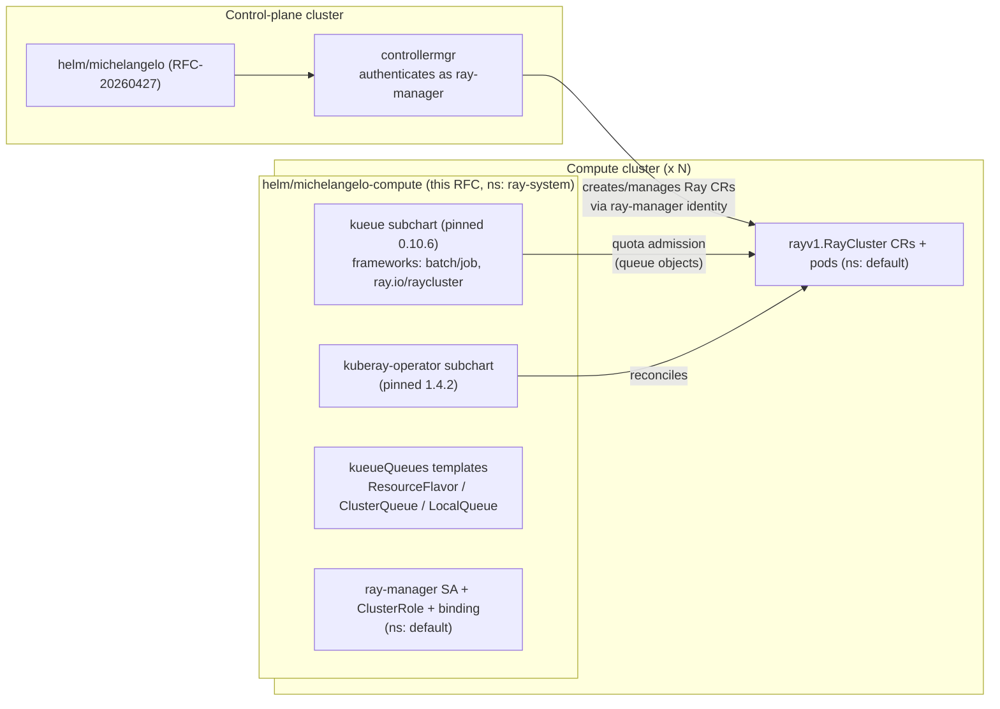
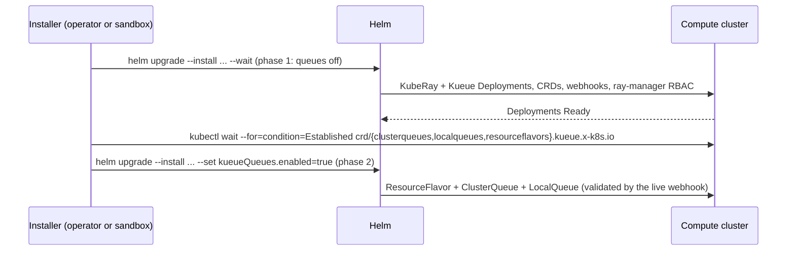

# RFC-20260805: Compute Cluster Helm Chart (`michelangelo-compute`)

- **Status:** Draft
- **Author(s):** @dragod812
- **Created:** 2026-08-05

---

## Problem statement

RFC-20260427 gave the Michelangelo **control plane** a Helm chart; the **compute side** still has none. Preparing a Kubernetes cluster to run Michelangelo batch workloads today means assembling the pieces by hand:

1. **KubeRay operator** — installed imperatively by the sandbox (`helm install kuberay-operator ...`) with the version pinned inside Python code.
2. **`ray-manager` RBAC** — the ServiceAccount + ClusterRole + ClusterRoleBinding the control plane authenticates as, `kubectl apply`'d from a raw manifest buried in `python/michelangelo/cli/sandbox/resources/`, invisible to anyone not reading sandbox source.
3. **Manual doc steps** — the operator guide walks the same objects by hand for non-sandbox clusters, as a parallel implementation that can (and has) drifted from what the sandbox actually does.

The compounding symptoms:

- **No versioned install unit.** There is no artifact an operator can `helm install`, `helm upgrade`, diff, or roll back on a compute cluster. Upgrading means "re-run the right commands in the right order."
- **No home for new per-cluster components.** RFC-20260731 (Kueue) adds a queueing stack to *every* compute cluster — an operator Deployment, a trimmed manager `Configuration`, and three queue custom resources with a webhook-ordering constraint. Sequencing that imperatively per cluster multiplies the fragility.
- **Adopters fork.** AV Labs, the first production adopter, built an internal `av-compute-cluster` chart to fill exactly this gap (KubeRay + Kueue subcharts, control-plane identity RBAC, chart-templated queue objects). Every serious adopter would have to repeat that work.

## Motivation

The Kueue rollout is the forcing function: RFC-20260731's Phase 1 requires a per-cluster install whose components have ordering dependencies and per-cluster configuration (quotas). Packaging them once, declaratively, is strictly cheaper than teaching the sandbox, the docs, and every adopter's provisioning pipeline the same sequence independently.

The pattern is already proven: AV Labs' internal chart bootstraps their production compute clusters this way. Upstreaming an open-source equivalent removes the incentive for per-adopter forks and completes the symmetry started by RFC-20260427 — one chart per cluster role:

| Cluster role | Chart | RFC |
|---|---|---|
| Control plane | `helm/michelangelo` | RFC-20260427 |
| Compute | `helm/michelangelo-compute` | this RFC |

Because the sandbox provisions its compute clusters through the same chart, the artifact operators install is exercised end-to-end by CI and by every developer sandbox — sandbox, docs, and production converge on one definition of "a Michelangelo compute cluster."

## Goals

- Two `helm upgrade --install` commands prepare any Kubernetes ≥1.27 cluster as a Michelangelo compute target: KubeRay operator, Kueue with the RayCluster integration, default queue objects, and `ray-manager` RBAC.
- The sandbox provisions every compute cluster (and the control-plane cluster when it doubles as one) through the chart — no raw compute-side manifests left in `sandbox.py`'s resources.
- Default rendering is behavior-identical to the manifests it replaces (field-for-field, apart from standard chart labels), so existing sandboxes see no change.
- The values operators actually need are first-class: queue names and quotas (`kueueQueues.*`), and subchart toggles (`kuberay-operator.enabled`, `kueue.enabled`) for clusters where an operator is already managed out-of-band.
- A CI gate lints and template-renders every supported profile on every chart change.

## Non-goals

- **Registration glue.** Minting the `ray-manager` token, and creating the `Cluster` CR plus the per-cluster CA/token Secrets **on the control plane**, stays in the operator guide — the same boundary AV Labs' chart draws. This boundary does *not* cleanly cover the object-storage credentials the collector sidecar consumes **on the compute side**; see Cross-cluster coupling below, which is unresolved.
- **The NVIDIA GPU stack.** Drivers, device plugin, and MIG tooling are cluster infrastructure (e.g. the NVIDIA GPU Operator), not chart contents.
- **Serving/online workloads and control-plane components** — batch (Ray) only; the control plane is RFC-20260427's chart.
- **Queueing semantics.** What Kueue does, the label contract, and the Kueue-aware scheduler are RFC-20260731's scope; this RFC covers only how the cluster-side pieces are packaged and installed.
- **Publishing the chart to a registry** (install-from-source for now; see Open questions).

## High-level architecture



### Chart layout

```
helm/michelangelo-compute/
├── Chart.yaml              # kuberay-operator + kueue dependencies (condition-gated)
├── Chart.lock              # committed; charts/*.tgz resolved at install time
├── values.yaml
├── README.md               # install + full values table
└── templates/
    ├── _helpers.tpl
    ├── NOTES.txt            # per-component status, phase-2 reminder, verify commands
    ├── rbac/
    │   └── ray-manager.yaml # SA + ClusterRole + ClusterRoleBinding (rayManager.create)
    └── kueue/
        ├── resource-flavor.yaml   # all gated by kueueQueues.enabled
        ├── cluster-queue.yaml
        └── local-queue.yaml
```

Subcharts are declared with `condition:` flags and resolved via `--dependency-update` (the `Chart.lock` is committed; tarballs are not vendored). Pins:

- **kuberay-operator `1.4.2`** — the version the sandbox previously installed imperatively, now declared in one place.
- **kueue `0.10.6`** (`oci://registry.k8s.io/kueue/charts`) — the latest 0.10.x patch. The 0.10 minor matches the control plane's `sigs.k8s.io/kueue` v0.10.x Go client; the `0.10.1`/`0.10.2` charts were never published to `registry.k8s.io` (see RFC-20260731, Version pinning). Note the version string carries **no `v` prefix**: the OCI registry publishes `0.10.6`, and `--version v0.10.6` fails to resolve. Declaring the pin in `Chart.yaml` is partly what retires this footgun — the imperative install it replaces asked for `v0.10.1`, a tag that is wrong on both counts. Beyond the footgun, **this pin is the chart's largest open risk — see "The Kueue pin defeats convergence" below.**

#### The Kueue pin defeats convergence, and needs an exit plan

This chart's stated motivation is to remove the incentive for per-adopter forks. The pin currently
works against that goal, and the comparison table below makes it visible: `av-compute-cluster` runs
Kueue **0.17.x** (`v1beta2` config) while this chart ships **0.10.6** (`v1beta1`). An adopter on 0.17.x
cannot install this chart without downgrading their queueing layer, so the fork this RFC exists to
retire would survive it.

Three consequences worth stating rather than discovering later:

1. **Behavior does not transfer between the two.** The Kueue `clusterSelector` skip for RayJobs
   ([kueue#7218](https://github.com/kubernetes-sigs/kueue/issues/7218)) postdates the 0.10 line, so
   admission behavior validated on the internal 0.17.x install is not evidence for what 0.10.6 does.
   RFC-20260731 carries this as an explicit Phase 1 test-plan item.
2. **`v1beta1` is deprecated** and scheduled out in later minors, so 0.10.6 is a shrinking island. Every
   month on it widens the eventual migration.
3. **The constraint is real, not arbitrary.** The 0.10 pin is forced by the control plane, not chosen
   here: `sigs.k8s.io/kueue` v0.10.x is what builds against the repo's `k8s.io/*` v0.31 libraries and the
   vendored `ray-operator v1.2.2`. The chart cannot move alone.

**Proposed resolution.** Name the trigger instead of leaving it open in two documents. The chart moves
off the 0.10 line when the repo bumps `k8s.io/*` past v0.31 — the same change that unblocks the Go
client — and the bump is then a three-line change: this `Chart.yaml` dependency, the
`sigs.k8s.io/kueue` module pin, and the `apiVersion` in the `kueue.managerConfig` override. Client and
server stay on one minor throughout. Until that bump, the chart documents the version gap in its README
so adopters on a newer Kueue know to set `kueue.enabled=false` and keep their own installation, taking
only the KubeRay operator, RBAC, and queue objects from this chart — which the existing subchart
toggles already permit, and which is the honest interim answer for AV Labs.


### Values interface

```yaml
rayManager:                       # identity the control plane uses on this cluster
  create: true                    # false if managed out-of-band
  serviceAccountName: ray-manager
  namespace: default              # must match where the control plane creates Ray resources
  clusterRoleName: ray-manager
  clusterRoleBindingName: ray-manager-binding

kuberay-operator:
  enabled: true                   # false when the operator is already on the cluster
  # any upstream kuberay-operator chart value nests here

kueue:
  enabled: true
  managerConfig:
    controllerManagerConfigYaml: |-   # full Configuration override; the one intentional
      ...                             # change vs upstream defaults is integrations:
                                      # frameworks — narrowed to
                                      # ["batch/job", "ray.io/raycluster"]

kueueQueues:
  enabled: false                  # phase-2 gate — see two-phase install below
  flavorName: default-flavor
  clusterQueueName: default-cluster-queue
  localQueueName: default         # what jobs reference via kueue.x-k8s.io/queue-name
  localQueueNamespace: default    # must match rayManager.namespace
  quota:                          # keys also derive the ClusterQueue's coveredResources
    cpu: 16
    memory: 32Gi
    nvidia.com/gpu: 4
```

Four contract details worth calling out:

- **`kueueQueues.quota` keys derive `coveredResources`.** Adding a key both covers and quotas that resource; a workload requesting an uncovered resource stays suspended. This mirrors the internal chart's design and keeps the two lists impossible to de-sync.
- **Partial quota overrides compose.** Helm deep-merges user values over defaults, so `--set kueueQueues.quota.cpu=64` (or a `-f` values file) changes CPU while memory/GPU keep chart defaults — this is the mechanism RFC-20260731's multi-cluster sandbox uses for per-cluster quotas.
- **Dotted resource keys need escaping with `--set`.** Helm reads `.` as a path separator, so `--set kueueQueues.quota.nvidia.com/gpu=8` silently builds a nested `nvidia: {com/gpu: 8}` map and leaves the real GPU quota at its default. The accelerator key must be escaped (`--set 'kueueQueues.quota.nvidia\.com/gpu=8'`) — which is why the sandbox passes per-cluster quotas as a generated `-f` values file rather than `--set`, and why operators should prefer values files too.
- **The `frameworks` override narrows the upstream default; it does not extend it.** Upstream's 0.10.6 chart enables ten integrations out of the box (`batch/job`, `ray.io/raycluster`, `ray.io/rayjob`, `jobset`, and six Kubeflow kinds). Setting `frameworks: ["batch/job", "ray.io/raycluster"]` therefore *disables* eight of them — deliberately, because Kueue should only gate workload kinds the platform actually plumbs the queue label for (RFC-20260731's label contract covers RayCluster only) and each enabled framework costs a webhook and controller on every compute cluster. The practical consequence: **enabling RayJob is a narrowing to undo, not a feature to add** (RFC-20260731, Open questions).

### Two-phase install

Kueue's queue objects are custom resources validated by Kueue's own webhook, so a fresh install cannot create the operator and the queue objects in one release pass — the CRDs must be established and the webhook serving first. Rather than hiding this in hooks, the chart makes it an explicit gate (`kueueQueues.enabled`, default `false`):



The explicit `kubectl wait` exists because Helm's `--wait` only covers the Deployments, not CRD establishment (the ordering constraint documented in RFC-20260731). Both phases are idempotent `helm upgrade --install` calls; re-running either is safe.

### Namespace and lifecycle consequences

Two properties of the upstream Kueue chart shape how this one behaves in production; both were verified against the pinned `0.10.6` artifact.

**Releasing Kueue into `ray-system` is safe.** The upstream chart routes every namespaced reference through `.Release.Namespace` — webhook service and its `clientConfig`s, certificates, Deployment, RBAC bindings — with no hardcoded `kueue-system`. Installing it as a subchart of a release in `ray-system` is therefore self-consistent, and co-locating it with the KubeRay operator keeps a compute cluster to one Michelangelo-owned namespace. The cost is muscle memory: Kueue's own docs and community runbooks all say `-n kueue-system`, so those commands come back empty here. NOTES.txt prints namespace-correct verify commands, and the operator guides should use `-n ray-system` throughout.

**Kueue's CRDs are release-managed, which cuts both ways.** The chart ships its CRDs in `templates/crd/` rather than Helm's special `crds/` directory:

- *Upside:* `helm upgrade` reconciles CRD schema changes like any other manifest, so this chart avoids the standard Helm trap where `crds/` is install-only and silently drifts across upgrades. A Kueue minor bump is a normal chart upgrade.
- *Downside:* `helm uninstall` **deletes the CRDs**, and deleting a CRD cascades to every object of that kind. Uninstalling on a live cluster removes every `Workload`, `ClusterQueue`, and `LocalQueue` on it, discarding admission state for running jobs. Uninstall is a cluster-drain operation, not a no-op — see Rollback.

### Cross-cluster coupling: object-storage credentials

One compute-side dependency does not fit the "chart prepares the compute side, guide does the registration" split cleanly, and it is worth resolving before this chart is called complete.

Ray log persistence is **on by default** (`controllermgr.jobs.k8sengine.mapper.logPersistence.enabled: true` in the control-plane chart). When enabled, controllermgr injects a `kuberay-collector` sidecar into every RayCluster head and worker pod, and that sidecar reads its S3 credentials through a `secretKeyRef`:

```yaml
# rendered by controllermgr into every Ray pod, on the COMPUTE cluster
env:
  - name: AWS_S3ID
    valueFrom:
      secretKeyRef:
        name: <controllermgr's jobs.k8sengine.mapper.logPersistence.credentialsSecret>
        key: AWS_ACCESS_KEY_ID       # and AWS_SECRET_ACCESS_KEY for AWS_S3SECRET
```

`credentialsSecret` defaults, control-plane-side, to `michelangelo.objectStorageSecretName` — `<release>-object-storage-credentials` — and the Secret of that name is templated by **`helm/michelangelo`**, so it exists only where the control-plane release is installed. A `secretKeyRef` is a *local* object reference: it resolves in the Ray pod's own namespace, on the compute cluster. The consequences:

- **Single-cluster sandbox:** works, but only coincidentally — control plane and compute cluster are the same cluster and namespace, so the Secret happens to be present.
- **Dedicated compute cluster:** nothing provisions it. `_create_compute_cluster` creates a Secret named `aws-credentials` with a single opaque `credentials` key (AWS-CLI ini format) — a different name *and* a different key shape. Every Ray pod therefore fails with `CreateContainerConfigError` and never starts.

This is a name contract spanning two charts on two clusters, with the producer on one side and the consumer on the other. The compute chart is the only compute-side artifact in the design, which makes it the natural owner — templating an `objectStorage.credentials` Secret next to `rbac/ray-manager.yaml`, keyed `AWS_ACCESS_KEY_ID`/`AWS_SECRET_ACCESS_KEY`, with the name defaulted to match controllermgr's default and overridable for operators who set `credentialsSecret` explicitly. Whether the chart should own it, or whether log persistence should be documented as opt-in for multi-cluster installs, is an Open question — but the current split leaves a default-on configuration broken on exactly the topology this chart exists to serve.

### Sandbox integration

`sandbox.py` replaces its imperative KubeRay install and raw RBAC/queue manifests with one code path, `_install_compute_cluster_chart()`, which runs both phases (with the CRD wait between them) against a named cluster:

- **Dedicated compute clusters** (`--create-compute-cluster`): every provisioned cluster gets the full chart; per-cluster `--compute-cluster-quotas` overrides ride phase 2 as a generated values file.
- **Control plane doubling as the compute cluster** (default single-cluster sandbox): the chart installs with `kuberay-operator.enabled=false`, because the sandbox already installs the operator there with its local image imports; the chart contributes Kueue, the queue objects, and the RBAC.

### Relationship to the internal `av-compute-cluster` chart

This chart deliberately mirrors the internal chart's shape (umbrella chart, pinned KubeRay + Kueue subcharts, quota-keyed `coveredResources`, two-phase queue gate) while diverging where the OSS platform differs:

| Aspect | `av-compute-cluster` (internal) | `michelangelo-compute` (this RFC) | Why the difference |
|---|---|---|---|
| Control-plane identity | `ma-job-controller` SA + upstream `edit` ClusterRole + Ray ClusterRole, **plus a token Secret** the bootstrap copies to the management cluster | `ray-manager` SA + one explicit ClusterRole; no token Secret template | The OSS registration guide creates the token during registration, and sandbox k3d clusters authenticate via kubeconfig. One explicit role keeps the OSS grant auditable. Token Secret is an Open question. |
| Kueue pin | 0.17.x (`v1beta2` config) | 0.10.6 (`v1beta1` config) | The OSS control plane's Go client is `sigs.k8s.io/kueue` v0.10.x; client and server stay on one minor (RFC-20260731). **This row blocks adoption rather than merely differing** — see "The Kueue pin defeats convergence" above. |
| Managed frameworks | `ray.io/raycluster` + `ray.io/rayjob` only | `batch/job` + `ray.io/raycluster` | RFC-20260731 keeps the upstream `batch/job` default and defers RayJob as a fast-follow. |
| Queue targeting | `default` LocalQueue per workload namespace; `LocalQueueDefaulting` admits unlabeled workloads | single LocalQueue; the control plane always stamps `kueue.x-k8s.io/queue-name` (default `"default"`) | The OSS jobs client owns label defaulting end-to-end (RFC-20260731's label contract); `LocalQueueDefaulting` is not enabled on the 0.10 line. |
| Workload namespaces | `workloadNamespaces` list + optional namespace creation | one `localQueueNamespace` value | The OSS control plane creates Ray resources in a single fixed namespace today; multi-namespace is an Open question. |
| Quota defaults | inert `"0"` quotas; a generator script sizes values from live node capacity | usable sandbox defaults (cpu 16 / memory 32Gi / gpu 4) | The OSS chart must admit workloads out-of-the-box in a sandbox; production installs override `kueueQueues.quota`. |
| GPU stack | NOTES-only guidance behind a `gpu.enabled` toggle | out of scope | Same boundary (NVIDIA stack is cluster infrastructure); install-notes guidance deferred. |

Convergence on the first, fourth, and fifth rows is expected as the Kueue pin advances and multi-namespace workloads land — the values schema was chosen so those become additive changes. The second row is the one that must actually be closed for this chart to retire the fork, and it is gated on the control plane's `k8s.io/*` bump rather than on anything in the chart.

## APIs and CRDs

No new CRDs, protos, or service APIs. The chart's public surface is:

- **The values interface above** — the operator contract for queue names, quotas, identity names, and subchart toggles.
- **Rendered objects.** The `ray-manager` SA/ClusterRole/ClusterRoleBinding render field-for-field identical to the raw manifests they replace (plus standard chart labels), and the queue objects render exactly the `ResourceFlavor`/`ClusterQueue`/`LocalQueue` contract documented in RFC-20260731.
- **CI contract.** `.github/workflows/helm-lint.yaml` gates every chart change: `helm dependency update`, `helm lint`, and template renders asserting (a) the default profile renders the ServiceAccount, (b) disabling both subcharts still renders the RBAC and renders no Deployment, (c) `kueueQueues.enabled=true` renders all three queue kinds, and (d) the default profile renders none of them. (The assertions grep with a `^kind:` anchor — Kueue's bundled CRD manifests contain indented `kind: ClusterQueue` lines under `spec.names`, which unanchored greps false-positive on.)

## Alternatives considered

### Alternative A: keep imperative installs (status quo)
**Pros:** no new artifact; sandbox already works.
**Cons:** no versioned unit, no upgrade/rollback, no operator-facing install; every new per-cluster component (starting with Kueue) extends a Python-encoded sequence that docs must mirror by hand.
**Why not chosen:** fails the single-artifact goal, and RFC-20260731 would triple the imperative surface.

### Alternative B: no umbrella chart — document the upstream charts plus a tiny RBAC-only chart
**Pros:** minimal code owned; upstream charts consumed directly.
**Cons:** operators hand-compose three installs with an ordering constraint between two of them; no single version pin ties "a Michelangelo compute cluster" together; the queue objects and manager `Configuration` still need to live somewhere, which recreates the umbrella chart in documentation form.
**Why not chosen:** the composition and its ordering *are* the product; an umbrella chart is the standard Helm mechanism for exactly this (and is what the internal chart converged on independently).

### Alternative C: fold compute-side objects into `helm/michelangelo`
**Pros:** one chart to maintain.
**Cons:** the two charts install into different clusters with different cardinalities (one control plane, N compute clusters) and different lifecycles; a combined chart forces every compute value through the control-plane release and breaks RFC-20260427's deliberate "control plane only" boundary.
**Why not chosen:** cluster role is the natural chart boundary; the default sandbox (one cluster playing both roles) is handled by installing both charts on it.

### Alternative D: single-phase install via a Helm post-install hook Job
**Pros:** one `helm install`; no phase-2 command to forget.
**Cons:** the hook Job needs a kubectl image, its own RBAC, and in-cluster retry logic to wait out CRD establishment and webhook readiness; failures surface as opaque hook timeouts; hook-created resources sit outside normal release rendering (skipped by `helm template`/diff tooling).
**Why not chosen:** two idempotent `helm upgrade` calls with an explicit `kubectl wait` between them are simpler, debuggable, and CI-testable; NOTES.txt prints the phase-2 command after phase 1 so it is hard to forget.

## Open questions

- [ ] **Chart publishing.** The chart installs from a repo checkout today. Publish to an OCI registry (e.g. GHCR) and Artifact Hub? And what chart-version cadence relative to `appVersion` — the same question RFC-20260427 left open for the control-plane chart; the two should get one answer.
- [ ] **Token Secret template.** The internal chart renders the control-plane identity's token `Secret` so bootstrap can copy credentials off the cluster. Should `rayManager` grow an optional `createTokenSecret` to shorten the registration guide, or does the token belong strictly to the registration flow?
- [ ] **Multi-namespace workloads.** When the control plane can create Ray resources in more than one namespace, adopt the internal chart's `workloadNamespaces` list (LocalQueue per namespace, optional namespace creation)? This also becomes the natural home for RFC-20260731's Phase 2 per-project queues: once the control plane resolves a project to a LocalQueue, the chart must be able to render more than one, and `kueueQueues` becomes a list rather than a single object. Worth designing the values schema for that now, since it is a breaking shape change later.
- [ ] **Kueue pin exit criteria.** The proposed trigger above (move when the repo bumps `k8s.io/*` past v0.31) is a proposal, not a decision. Do maintainers accept it, and does anything else force the bump sooner — for example an adopter blocked on `v1beta2`, or the RayJob `clusterSelector` behavior differing on 0.10.6?
- [ ] **Who owns the object-storage credentials Secret?** Should the chart template it (defaulting the name to controllermgr's `<release>-object-storage-credentials`, accepting the cross-chart name coupling), should controllermgr stop defaulting the name and require it be set per cluster, or should log persistence default to off for multi-cluster installs? See Cross-cluster coupling — as it stands, a dedicated compute cluster cannot start a Ray pod with default settings.
- [ ] **Compute-cluster observability.** The chart installs two controllers that export Prometheus metrics (`kueue-controller-manager`, `kuberay-operator`), but nothing on a compute cluster scrapes them, and queue-state visibility today is `kubectl get/describe clusterqueue`. Should the chart ship ServiceMonitors behind a `metrics.serviceMonitor.enabled` toggle, or does per-cluster monitoring belong entirely to the operator's own stack?
- [ ] **Guarding CRD deletion.** Because Kueue's CRDs are release-managed, `helm uninstall` cascades into every `Workload` and queue object on the cluster. Should the chart stamp `helm.sh/resource-policy: keep` on the queue CRDs (safer uninstall, but leaves orphaned CRDs behind and complicates a genuine teardown), or is documenting uninstall as a drain operation sufficient?
- [ ] **GPU install notes.** Add a `gpu.enabled`-style NOTES block (device-plugin verification, taints/tolerations gotchas for Ray pods) without taking on the NVIDIA stack itself?

## Rollout strategy

The chart ships as the first two PRs of the RFC-20260731 implementation stack, so Kueue's per-cluster install lands already packaged:

### Phase A — chart with KubeRay + RBAC (stack PR 0)
`helm/michelangelo-compute` skeleton: kuberay-operator subchart, `ray-manager` RBAC templates, NOTES/README. Sandbox rewired to install the chart on every compute cluster (raw `rbac-ray.yaml` deleted); the operator guide's setup step becomes the chart install. CI lint/template gate added.
**Backward compatibility:** rendered defaults are field-identical to the replaced manifests apart from chart labels; sandbox CLI flags are unchanged.

### Phase B — Kueue subchart + queue objects (stack PR 1)
Kueue 0.10.6 subchart (release namespace `ray-system`) with the trimmed manager `Configuration`; `kueueQueues.*` templates behind the phase-2 gate; sandbox runs both phases with the CRD `kubectl wait` between them. Per-cluster quota overrides arrive as phase-2 values (consumed later in the stack by the multi-cluster sandbox).

**Sequencing note.** Installing Kueue via this chart is safe on its own — with no `kueue.x-k8s.io/queue-name` label on any workload and `manageJobsWithoutQueueName` at its default `false`, Kueue observes and admits nothing. But the moment RFC-20260731's label plumbing starts stamping that label, RayClusters begin getting suspended, and suspension is only survivable once that RFC's **Phase 0 prerequisites** are in place: the merged non-terminal `RAY_CLUSTER_STATE_SUSPENDED` (PR #1700, done) and the creation-budget split (not yet built). Phase B may therefore land before those, but the label plumbing must not. The operator guide should carry the same warning for anyone installing the chart by hand on a cluster whose control plane already stamps queue labels.

### Rollback
Each phase is an independent PR revert; reverting Phase A returns the sandbox to the raw-manifest path.

Operationally the release is reversible, but reversal is **destructive on a live cluster** and the blast radius grows with each step — everything here is release-managed, so unwinding deletes objects rather than orphaning them:

| Action | Effect | Safe when |
|---|---|---|
| `helm rollback` to a prior revision | Re-applies that revision's objects; quota values revert | Anytime — quota changes only re-gate *future* admissions |
| `--set kueueQueues.enabled=false` | **Deletes** the ClusterQueue/LocalQueue. Admitted workloads lose their queue and Kueue stops managing them; pending ones stay suspended with nothing to admit them | Cluster is drained, or you are immediately re-applying different queue objects |
| `--set kueue.enabled=false` / `helm uninstall` | Removes the operator **and its CRDs**, cascading to every `Workload`/queue object on the cluster (see Namespace and lifecycle consequences) | Cluster is drained |

Draining first (`kubectl get workload -A` empty) is the safe order for the bottom two rows. Phase 1 admission for existing pipelines is unaffected by Phase 2 scheduler rollback, which is a config flag on the control plane and touches no compute-cluster object.

## References

- [RFC-20260427: Michelangelo Control Plane Helm Chart](../20260427-michelangelo-helmchart/20260427-michelangelo-helmchart.md)
- [RFC-20260731: Kueue-Based Queueing and Multi-Cluster Assignment for Ray Workloads](../20260731-kueue-integration/20260731-kueue-integration.md) — the queueing semantics this chart installs; its Phase 0 prerequisites gate the label plumbing, not this chart
- Chart source (added by the implementation stack): `helm/michelangelo-compute` in [michelangelo](https://github.com/michelangelo-ai/michelangelo)
- Operator guide: `docs/operator-guides/setup/register-a-compute-cluster-to-michelangelo-control-plane.md`
- [kuberay-helm](https://github.com/ray-project/kuberay-helm) (kuberay-operator subchart)
- [Kueue installation](https://kueue.sigs.k8s.io/docs/installation/) (subchart: `oci://registry.k8s.io/kueue/charts/kueue`)
- AV Labs' internal `av-compute-cluster` chart (design reference; requirements context in [Batch Job Scheduler Requirements for AV Labs](../20260731-kueue-integration/Batch%20Job%20Scheduler%20Requirements%20for%20AV%20Labs.md))
