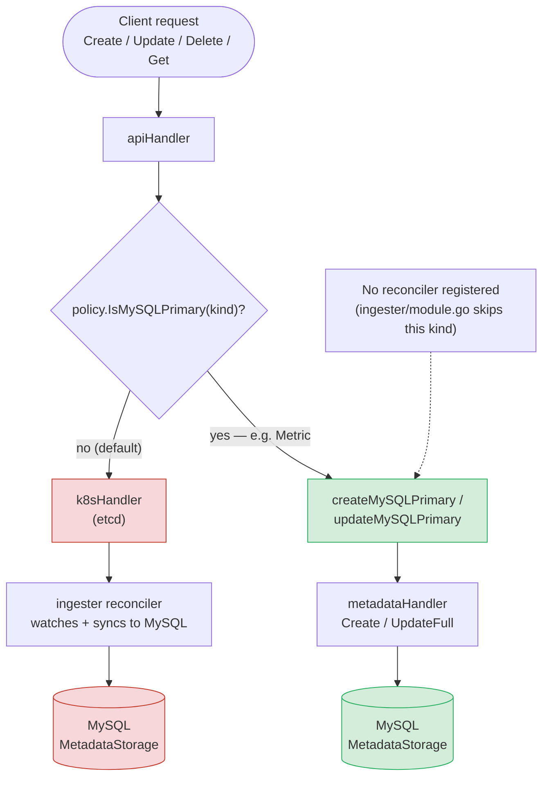
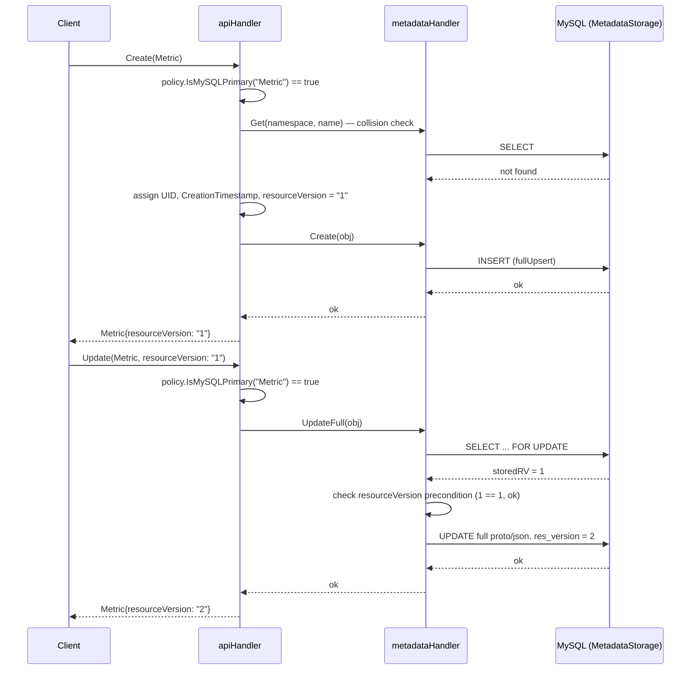

# RFC-20260904-mysql-primary-storage-mode: Mutable, MySQL-Primary Storage Mode for Never-Reconciled CRD Kinds

- **Status:** Draft
- **Author(s):** @weric
- **Created:** 2026-09-04
- **Internal ERD:** N/A

---

## Problem statement

Some CRD kinds are pure metadata records: they're created once, occasionally updated in place, read
back by name, and never reconciled by any controller. `Metric` (a metric-type definition object) is
the motivating example. Today every CRD kind is written to etcd first regardless of whether anything
ever watches or reconciles it, because `go/api/handler`'s `Create`/`Update`/`Delete` paths assume a
k8s (etcd) object exists for every kind, with `go/storage`'s MySQL-backed `MetadataStorage` used only
as a secondary sync target or a post-eviction fallback. For a kind like `Metric`, this means objects
accumulate in etcd forever with no controller ever reading, reconciling, or evicting them, growing
etcd's storage and memory footprint for no operational benefit.

The codebase already has a mechanism for getting a kind out of etcd — the write-once/immutable
eviction pattern (`storage/mysql/mysql.go`'s `directUpdate`, used today by `LineageEvent`,
`PipelineRun`, `Revision`, `RayJob`, `SparkJob`) — but it is deliberately built for **write-once,
spec-frozen** objects: once evicted, `directUpdate` discards the incoming object's spec entirely and
replays only the stored proto with a metadata (labels/annotations) overlay. `Metric`'s spec
(`Dimensions`, `Filters`) is legitimately mutable after creation, so this existing mechanism is the
wrong fit — using it would silently make `Metric` write-once, breaking any caller that updates it
post-creation.

There is currently no supported way to keep a CRD kind out of etcd entirely while its spec remains
live-updatable through the standard `Create`/`Update` path.

## Motivation

Every `Metric` object created today lives in etcd indefinitely, with no reconciler and no eviction
path compatible with its mutability requirements. As more metric-type definitions accumulate, this
is a permanent, unbounded, low-value tax on etcd — the exact failure mode the existing
write-once/immutable pattern was built to prevent for other kinds, just not for mutable ones. Solving
this now, before `Metric` volume grows further and before other similarly-shaped "mutable metadata
record" kinds get added to the platform, avoids both an ongoing etcd cost and a second team later
reinventing the same fix under time pressure.

## Goals

- A CRD kind can opt in to a mode where `Create`, `Update`, `UpdateStatus`, `Delete`, `Get`, `List`,
  and `DeleteCollection` all route directly to MySQL-backed `MetadataStorage`, with etcd never
  involved for that kind at any point in its lifecycle.
- The object's spec (not just metadata) remains fully mutable after creation, with the same
  optimistic-concurrency guarantee (resource-version precondition check) that etcd/k8s normally
  provides.
- No per-kind reconciler is registered for opted-in kinds — `go/components/ingester` must not set up
  a watch for something that will never be reconciled.
- Opting a kind in is a small, explicit, reviewable change — not a proto/codegen migration.

## Non-goals

- Migrating this to a proto-level option (e.g. extending `ResourceDescriptor` in
  `proto/api/options.proto`, alongside the existing `immutable` flag) is explicitly out of scope for
  this RFC. That would be the more "correct" long-term home for this flag, following the same
  codegen path as `IsImmutableKind()`, but requires regenerating every CRD file for a net-new
  boolean most kinds don't need. This RFC uses a runtime policy instead (see Alternatives) and leaves
  the proto-option migration as a future RFC if enough kinds adopt this mode to justify it.
- Backfilling or migrating any kind's *existing* etcd objects into MySQL-primary mode. This RFC
  covers only kinds created after opting in; `Metric` is a net-new CRD in this repo (ported from an
  internal fork) with no pre-existing etcd backlog to migrate.
- Any change to admission-webhook coverage for opted-in kinds. See Open questions.

## High-level architecture

Routing decision at the top of every `apiHandler` operation — a normal kind still goes through etcd
first (with the existing MySQL fallback/sync paths unchanged); an opted-in kind skips etcd entirely:



Sequence for the two opted-in operations that change behavior (`Create`, `Update`) — etcd never
appears on this path at all:



Get/Delete/List/DeleteCollection reuse (or trivially extend) the existing etcd-then-MySQL-fallback
pattern already in `apiHandler`, since a `NotFound` from a k8s call that was never made behaves the
same as one that failed.

## APIs and CRDs

No proto/CRD schema changes for the mechanism itself — the opt-in is a Go-level runtime policy, not a
proto option (see Non-goals). Public interface changes:

- New `storage.MySQLPrimaryPolicy` interface and `storage.NewStaticMySQLPrimaryPolicy(kinds ...string)`
  constructor, mirroring `go/cascadedelete.RetainPolicy` / `NewStaticRetainPolicy` exactly:
  ```go
  type MySQLPrimaryPolicy interface {
      IsMySQLPrimary(kind string) bool
  }
  ```
- New `storage.MetadataStorage` method:
  ```go
  UpsertDirectFull(ctx context.Context, object runtime.Object, indexedFields []IndexedField) error
  ```
  a full-field overwrite combined with the resource-version-checked optimistic concurrency that
  `directUpdate` already has — a mode that didn't previously exist (`fullUpsert` has no RV check;
  `directUpdate` has the RV check but discards the incoming spec).
- New `api/handler.MetadataHandler` method `UpdateFull`, calling `UpsertDirectFull` instead of the
  existing hardcoded `direct: true` (write-once) path.
- As the first (and currently only) user of this mode: `Metric`, ported into this repo at
  `proto/api/v2/metric.proto` from an internal fork's `v2beta1.Metric`, is registered via
  `mySQLPrimaryKinds = []string{"Metric"}` in both `go/cmd/apiserver/main.go` and
  `go/cmd/controllermgr/main.go`. Both binaries must agree on this list — there is no shared source
  of truth beyond keeping the two literals in sync by hand (see Open questions).

## K8s-native semantics that no longer apply

Because etcd/k8s is never involved for an opted-in kind, a few things that are normally free from the
k8s API server have to be examined case by case. Split into what's genuinely gone versus what's still
required but for a different reason:

**Genuinely gone — not needed, not replaced:**
- **RBAC via k8s** (`SubjectAccessReview` scoped to the CRD resource) — there's no k8s object to
  authorize against. `apiHandler`'s own auth module (`go/auth`) becomes the sole enforcement point,
  same as it already is for every non-etcd-native concern today.
- **Generation / `status.observedGeneration` drift detection** — k8s normally auto-increments
  `.metadata.generation` on every spec change so a controller can tell "have I reconciled the latest
  spec yet." Moot here by construction: an opted-in kind has no controller (that's the point of this
  mode), so there's nothing to compare `generation` against `observedGeneration` for.
- **OwnerReferences-driven garbage collection** — confirmed as real, active usage elsewhere in this
  codebase (`go/components/pipelinerun/cascade_test.go`: `Pipeline` owns `PipelineRun`/`TriggerRun` via
  ownerReferences, cascade-deleted by k8s GC). An opted-in kind cannot rely on this; if a future
  MySQL-primary kind ever needs parent→child cascade delete, it has to be implemented explicitly in
  `apiHandler`, not inherited from k8s.
- **Admission webhooks** (mutating/validating, registered against the CRD) — bypassed entirely. This
  is already called out as an open question below (`ValidationHandler` must cover 100% of what a
  webhook would have enforced).
- **`kubectl get/describe/edit`** on the kind — the CRD *schema* is still registered in k8s
  (`crd.SyncCRDs` installs it unconditionally for every kind in `v2pb.YamlSchemas`, MySQL-primary or
  not), so `kubectl` recognizes the kind, but no instances ever appear:
  `kubectl get metric.michelangelo.api -A` returns empty even while real rows exist in MySQL. This is
  a real operational-UX loss for on-call/debugging workflows built around kubectl; `mactl` (which goes
  through the apiserver's own API, not the k8s API server) is the correct tool for these kinds
  instead.

**Still required — but as MySQL's own bookkeeping, not a k8s artifact:** confirmed against the actual
`metric` table schema, which has three `NOT NULL` columns with no default:
```sql
CREATE TABLE IF NOT EXISTS `metric` (
    `uid`         VARCHAR(255)      NOT NULL,  -- PRIMARY KEY
    `res_version` BIGINT UNSIGNED   NOT NULL,
    `create_time` DATETIME          NOT NULL,
    ...
    PRIMARY KEY (`uid`),
    KEY `metric_namespace_name` (`namespace`, `name`),
```
- **UID** is the literal `PRIMARY KEY` of the row — `namespace`/`name` is only a secondary index used
  to resolve to a UID. This is unconditionally required, not a k8s convention being cargo-culted.
- **CreationTimestamp** (`create_time`) is `NOT NULL` — MySQL needs a real value, independent of
  whether k8s ever sees the object.
- **ResourceVersion** (`res_version`) is also `NOT NULL`, and easy to mistake for a k8s-only concept
  since it originates from `.metadata.resourceVersion` — but it's not gone, it's repurposed as
  `directFullUpdate`'s own optimistic-concurrency token (`SELECT ... FOR UPDATE`, compare incoming RV
  to `storedRV`, reject on mismatch, else write `storedRV + 1`). Drop it and two concurrent
  `UpdateMetric` calls can silently clobber each other — a MySQL-row correctness concern that exists
  whether or not etcd is anywhere in the picture. This is the field the initial implementation missed
  seeding on `Create` (see Rollout strategy — verification), causing every first insert to fail with
  MySQL error 1366 against the `NOT NULL BIGINT UNSIGNED` column.

## Alternatives considered

### Alternative A: Extend `ResourceDescriptor.immutable`-style proto option

Add a new proto-level option (e.g. `mysql_primary: true` alongside the existing `immutable` field in
`proto/api/options.proto`), driving `protoc-gen-kubeproto` to generate an `IsMySQLPrimaryKind() bool`
method on the CRD struct itself, consumed the same way `IsImmutableKind()` already is in
`go/components/ingester/controller.go`.

**Pros:** Idiomatic with the codebase's existing precedent for exactly this kind of per-kind flag;
the flag travels with the type definition itself, so there's no separate list to keep in sync across
binaries; compiler/codegen-enforced rather than a stringly-typed runtime list.

**Cons:** Requires touching the proto/codegen pipeline (`protoc-gen-kubeproto` and friends) and
regenerating every existing CRD file's generated Go code, even though only one kind needs the new
flag today. Materially larger blast radius and review surface for a feature with a single initial
consumer.

**Why not chosen:** Given `Metric` is the only kind that needs this today, the runtime-policy
approach (Alternative B, i.e. this RFC's design) delivers the same capability with a much smaller,
more reviewable diff. This alternative is the natural next step if enough kinds adopt MySQL-primary
mode that keeping two hand-written `mySQLPrimaryKinds` lists in sync becomes its own source of bugs.

### Alternative B (chosen): Runtime per-kind policy, mirroring `cascadedelete.RetainPolicy`

**Pros:** Zero proto/codegen changes; matches an existing, already-reviewed pattern in this exact
codebase (`RetainPolicy`); the entire mechanism is expressible as new files plus small, additive
diffs to `go/api/handler`, `go/storage`, and `go/components/ingester`, with no regeneration of
unrelated CRD code.

**Cons:** The opt-in list is a plain string match against kind names, hand-duplicated between
`cmd/apiserver` and `cmd/controllermgr`, with no compiler-enforced link to the actual Go type — a
typo'd kind name fails silently by falling through to the normal etcd path rather than erroring.

**Why not chosen (n/a — this is the chosen design):** The smaller blast radius and precedent match
outweigh the stringly-typed-list downside for a single-consumer feature; the downside is called out
explicitly as an open question/rollout risk below rather than solved in this RFC.

## Open questions

- [ ] **Validation/webhook parity:** a MySQL-primary `Create`/`Update` bypasses etcd entirely, so any
  k8s admission-webhook logic for an opted-in kind is also bypassed. `ValidationHandler` becomes the
  sole enforcement point for these kinds. Has `go/api/webhook/` been audited to confirm whatever
  validation `Metric` needs is fully reachable through `ValidationHandler`, or does some validation
  logic need to be ported there before this ships more broadly?
- [ ] **Keeping the two `mySQLPrimaryKinds` lists in sync:** today this is two hand-written
  `[]string{"Metric"}` literals, one in `cmd/apiserver/main.go` and one in `cmd/controllermgr/main.go`,
  with no shared source of truth and no compile-time check that they match. Is a shared constant (or
  a single shared config value) worth adding now, or is manual sync acceptable at current adoption
  (one kind)?
- [ ] **Resource-version semantics:** MySQL's `res_version` (a `BIGINT UNSIGNED`, seeded at `1` on
  create, incremented by `storedRV + 1` on each update) is now the *only* resource version these
  kinds ever have — there is no etcd RV to reconcile against. Does any client code assume
  k8s-shaped resourceVersion semantics (e.g. watch bookmarks, list continuation tokens) that would
  break for a MySQL-primary kind?
- [ ] Should this mechanism eventually migrate to the proto-option approach (Alternative A) once/if a
  second or third kind adopts it, or is the runtime-policy approach acceptable indefinitely?

## Rollout strategy

- **Phase 1 (this RFC's scope):** `Metric` is the sole kind opted into MySQL-primary mode. It is a
  net-new CRD in this repo — there is no existing etcd backlog to migrate, and no rollback data
  migration is required if this is reverted.
- **Verification performed pre-merge:** end-to-end smoke test against a live k3d sandbox cluster
  (`scala-hello-test`) confirmed `CreateMetric` → `GetMetric` → `UpdateMetric` (live spec mutation,
  resource version 1 → 2) → `GetMetric` all succeed through the new path, that
  `kubectl get metric.michelangelo.api -A` returns no objects (etcd is never touched), and that the
  corresponding row is present and correctly versioned in the `metric` MySQL table.
- **Feature flags:** none — the opt-in is the static `mySQLPrimaryKinds` list itself, which acts as
  the flag. Adding a kind to the list is the enable action; removing it (before any objects of that
  kind exist) is the disable action. There is no runtime toggle for a kind that already has
  MySQL-primary objects, since removing it from the list would leave existing objects unreadable via
  the normal etcd-first `Get` path.
- **Rollback:** for `Metric` specifically (no pre-existing objects before this change), rollback is a
  straightforward code revert — no data migration needed. For any future kind, rollback after
  objects have been created in MySQL-primary mode is materially harder (see previous bullet), so
  opting a kind in should be treated as a low-reversibility decision, not a toggle.

### Migration concern: a kind starts MySQL-primary, later needs a controller

A realistic day-2 scenario: a kind is opted into MySQL-primary mode on day 1 because nothing
reconciles it, objects accumulate for months, and then a real business need for a controller shows up
(e.g. the metric-type definition needs to trigger downstream provisioning on create). Removing the
kind from `mySQLPrimaryKinds` does **not** make this a clean toggle — it only changes the path for
*new* `Create`/`Update` calls going forward. Every object created while the kind was MySQL-primary
still exists only as a MySQL row; a controller (which watches etcd via `controller-runtime`
informers) has no way to discover them. Concretely, this migration needs:

1. **A reverse-direction backfill tool.** The existing `ma-backfill`-style tooling in this codebase
   only goes etcd → MySQL (syncing etcd objects into `MetadataStorage`, used for the
   write-once/immutable eviction pattern). Migrating a MySQL-primary kind onto etcd needs the
   opposite: read every existing row for that kind out of MySQL and `Create` it in etcd. No such tool
   exists today and one would need to be built.
2. **UID preservation.** The backfill must recreate each object with its *original* UID, not a
   freshly-assigned one — otherwise anything that recorded the original UID (external references,
   audit logs, cross-system joins) silently breaks. Whether the k8s API server honors a
   client-supplied UID on `Create` for a CRD (as opposed to server-assigning one, which is the
   built-in-resource default behavior) needs to be verified before this migration is attempted.
3. **ResourceVersion cannot be preserved.** etcd assigns its own resourceVersion from its internal
   revision counter on write — there is no way to make an etcd object's RV equal the MySQL
   `res_version` it's migrating from. Every backfilled object's resourceVersion resets to whatever
   etcd assigns on that write. This is invisible to anything that only reads current state, but would
   look like "the object was deleted and recreated" to any client naively diffing resourceVersions
   across the migration (there are none today, per the earlier UI/watch analysis, but this should be
   called out for any future consumer).
4. **Coordinated flip across both binaries.** `mySQLPrimaryKinds` is duplicated in
   `cmd/apiserver/main.go` and `cmd/controllermgr/main.go` (see Open questions above). If the two
   binaries deploy out of order during this flip, there's a window where one binary treats the kind as
   MySQL-primary and the other doesn't — e.g. `apiserver` already routes new `Create`s to etcd, but
   `controllermgr`'s ingester still skips registering a reconciler for it, so nothing reconciles the
   newly-created etcd objects until `controllermgr` catches up. This makes the existing "keep the two
   lists in sync" concern materially higher-stakes at migration time than at initial opt-in time.
5. **A cutover freeze window.** Without pausing writes to the kind during backfill, an `Update` that
   lands in MySQL after the backfill already read that row would be silently lost once the kind flips
   to etcd-primary and MySQL stops being consulted for it. The safest sequencing is: freeze writes →
   backfill into etcd → flip the policy on both binaries → resume writes → let the existing generic
   ingester (already unconditionally present for every non-MySQL-primary kind) start syncing the now
   etcd-primary objects back into MySQL as a read cache, same as any other kind.
6. **First-reconcile side effects on adopted objects.** Once a controller exists and starts watching,
   every backfilled object triggers that controller's create-path reconcile logic for the first time —
   even though the object may be months old from a user's perspective. Any side-effecting logic in the
   controller's initial reconcile (e.g. sending a "new object created" notification, kicking off
   provisioning) needs an explicit backfill/adoption mode to suppress those actions for objects that
   are being adopted rather than genuinely created.

None of this is needed for `Metric` today — it has no controller and no plan to get one — but it's
the direct cost of the "opting in is a low-reversibility decision" line above, spelled out concretely
rather than left as a warning. Any team opting a kind into MySQL-primary mode should treat "does this
kind risk needing a controller later" as part of the initial decision, not something to defer.

## References

- Prior art in this codebase: `go/cascadedelete.RetainPolicy` (runtime per-kind policy pattern this
  RFC's `MySQLPrimaryPolicy` mirrors) and `ResourceDescriptor.immutable` /
  `protoc-gen-kubeproto`'s `IsImmutableKind()` (the proto-driven precedent, considered as
  Alternative A).
- Implementation PR: michelangelo-ai/michelangelo (branch `weric/mysql-primary-storage-mode`).
